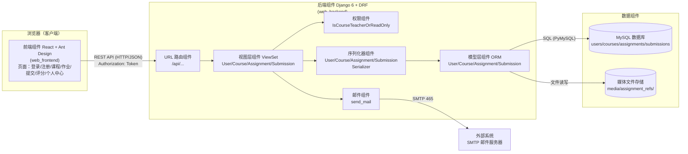

# 组件图（概要设计说明书）

- **版本**：v1.0　**日期**：2026-08-25
- **说明**：单体版本的系统组件划分与依赖关系。逻辑组件图（本图）+ 部署说明。组件级顺序图见同目录 `组件级顺序图.md`（COMP-SEQ01~14）。

## 1. 系统组件图（逻辑视图）

## 2. 组件职责与接口说明

| 组件 | 职责 | 对外接口/依赖 | 代码位置 |
|---|---|---|---|
| 前端组件 | 页面渲染、表单校验、文件读取、Token 管理 | HTTP/JSON 调用后端 REST API | `web_frontend/src/` |
| 视图层组件 | 处理请求、权限判断、业务校验、响应组装 | 依赖序列化器、权限组件、模型组件 | `apps/views.py` |
| 序列化器组件 | 数据校验与序列化（密码哈希、文件 URL、计算字段） | 依赖模型组件 | `apps/serializers.py` |
| 权限组件 | 教师创建、课程教师（或管理员）修改/删除 | 无 | `apps/permissions.py` |
| 模型层组件 | 领域对象与 ORM 映射 | MySQL（PyMySQL 驱动） | `apps/models.py` |
| 邮件组件 | 注册成功通知（SMTP，控制台/真实后端可切换） | 外部 SMTP 服务器 | `views.py`（UserViewSet）+ `settings.py` |
| MySQL 组件 | 持久化 4 张业务表 | - | 数据库 `online_teach` |
| 媒体存储 | 保存作业参考文档 | - | `media/assignment_refs/` |

## 3. 接口清单（REST API 一览）

| 方法 | 路径 | 说明 | 权限 |
|---|---|---|---|
| POST | /api/users/ | 用户注册 | 匿名 |
| GET | /api/users/me/ | 当前用户信息 | 登录 |
| POST | /api/auth/token/ | 登录获取 Token | 匿名 |
| GET/POST | /api/courses/ | 课程列表/创建 | 登录 / 教师 |
| GET/PUT/PATCH/DELETE | /api/courses/{id}/ | 课程详情/修改/删除 | 登录 / 授课教师 |
| POST | /api/courses/{id}/enroll/ | 学生选课 | 登录 |
| POST | /api/courses/{id}/unenroll/ | 学生退课 | 登录 |
| GET/POST | /api/assignments/ | 作业列表（按 course 过滤）/创建 | 登录 / 教师 |
| GET/PUT/PATCH/DELETE | /api/assignments/{id}/ | 作业详情/修改/删除 | 登录 / 授课教师 |
| GET/POST | /api/submissions/ | 提交列表（按 assignment 过滤）/提交 | 登录 |
| GET/PATCH | /api/submissions/{id}/ | 提交详情/修改（只读字段保护） | 登录 |
| POST | /api/submissions/{id}/grade/ | 教师评分 | 授课教师 |

## 4. 部署说明（当前单体）

| 组件 | 运行方式 | 端口 |
|---|---|---|
| 前端 | Vite dev server（开发）/ 构建后静态托管 | 3000 |
| 后端 | Django dev server（开发）/ 生产建议 gunicorn | 8000 |
| 数据库 | MySQL 8（本机） | 3306 |

> **容器化（第 2-4 天任务）**：前端、后端、数据库将分别放入 Docker 容器，并提供 Dockerfile、初始化脚本与 README 启动说明；CI 流水线将按任务书第三部分搭建。
