# 组件级顺序图（概要设计说明书）

- **版本**：v1.0　**日期**：2026-08-29
- **范围**：用例清单 UC01~UC14 各 1 张，编号 COMP-SEQ01 ~ COMP-SEQ14
- **说明**：在系统级顺序图（SYS-SEQ）基础上展开后端内部组件：URL 路由、视图、序列化器、权限、模型、邮件、媒体存储。不展开到具体方法名（方法级见 OBJ-SEQ）。

---

## UC01 用户注册（COMP-SEQ01）

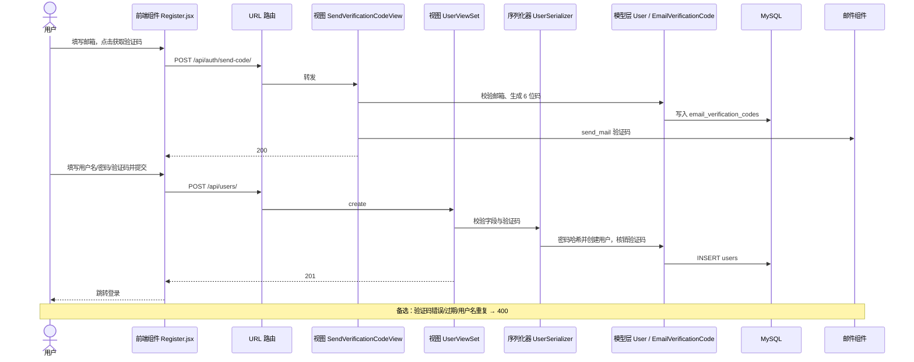

## UC02 用户登录（COMP-SEQ02）

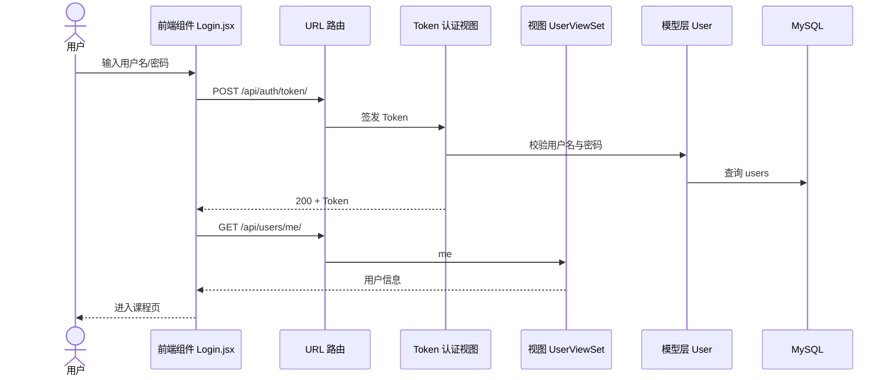

## UC03 浏览课程列表与详情（COMP-SEQ03）

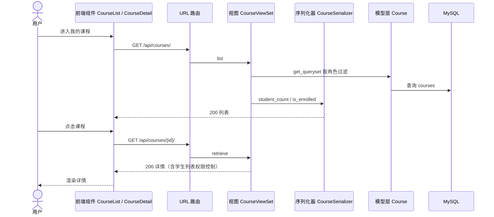

## UC04 学生选课 / 退课（COMP-SEQ04）

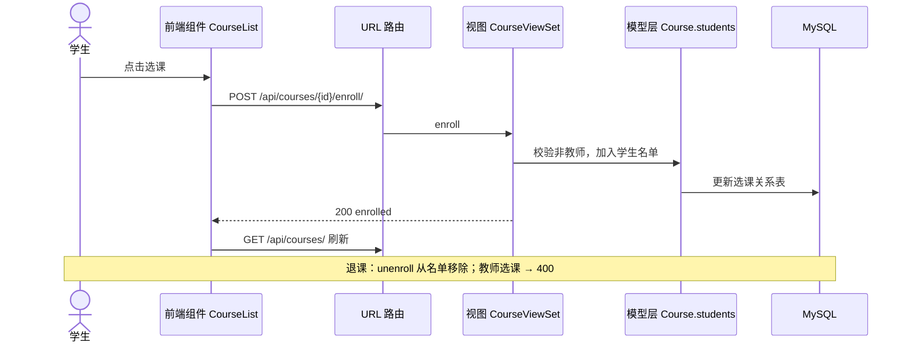

## UC05 教师创建课程（COMP-SEQ05）

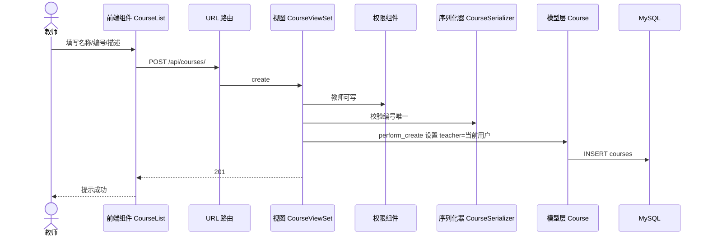

## UC06 教师编辑 / 删除课程（COMP-SEQ06）

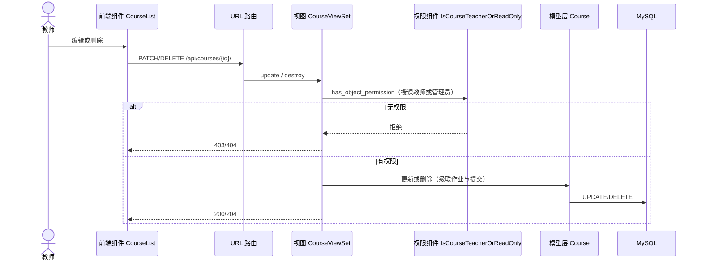

## UC07 教师管理作业（COMP-SEQ07）

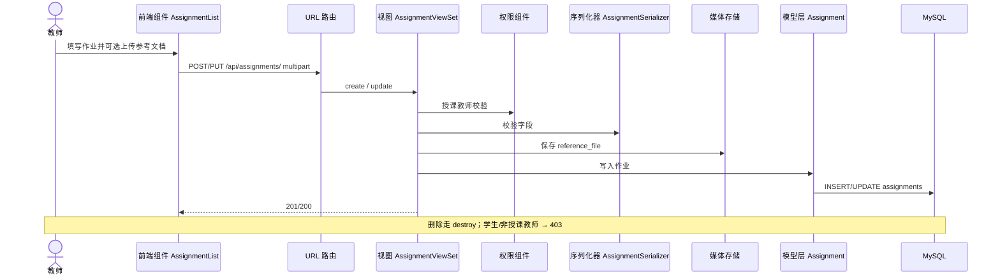

## UC08 查看作业详情并下载参考文档（COMP-SEQ08）

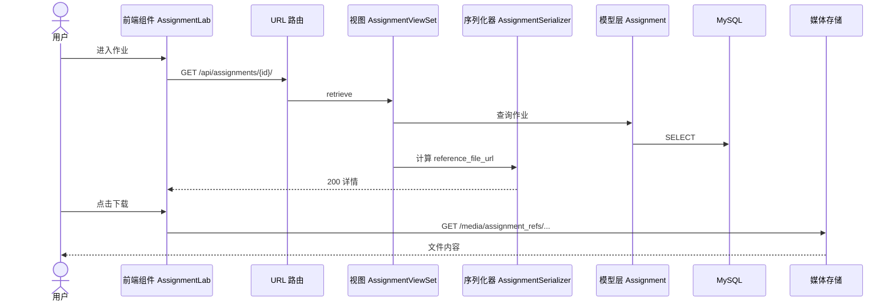

## UC09 学生提交作业（COMP-SEQ09）

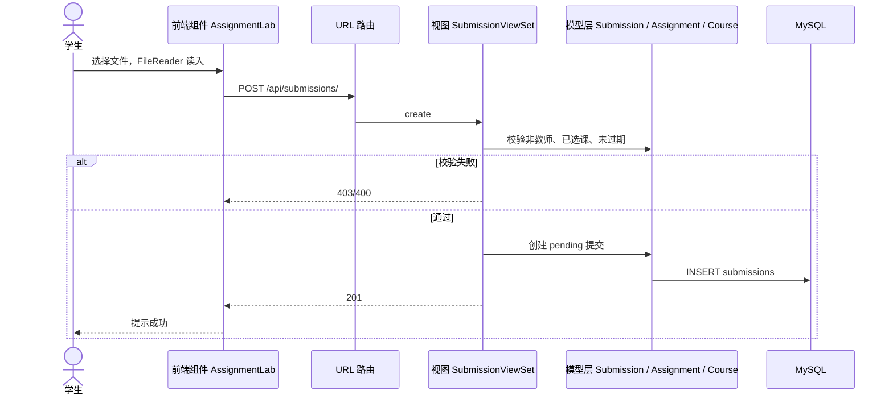

## UC10 学生查看个人提交记录（COMP-SEQ10）

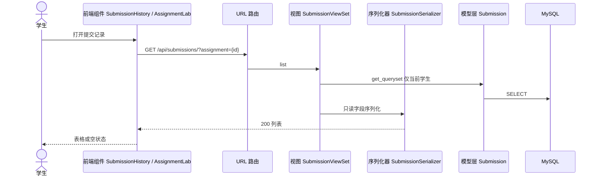

## UC11 教师查看某作业全部提交（COMP-SEQ11）

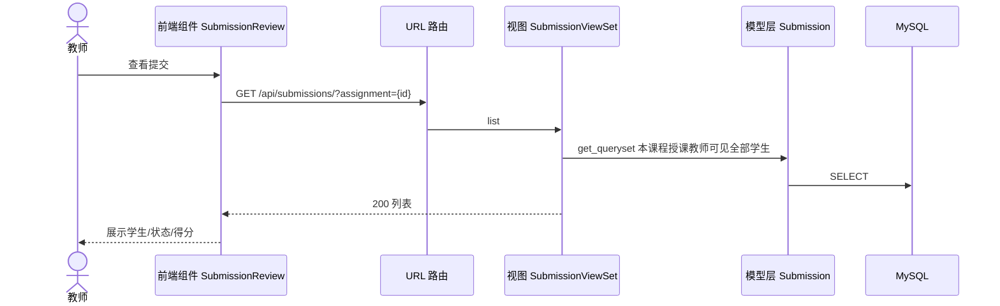

## UC12 教师评分（COMP-SEQ12）

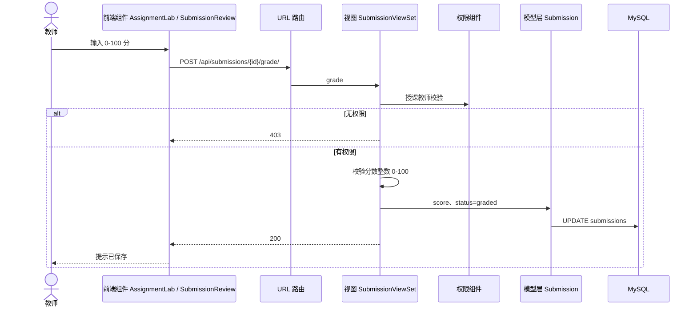

## UC13 查看个人信息（COMP-SEQ13）

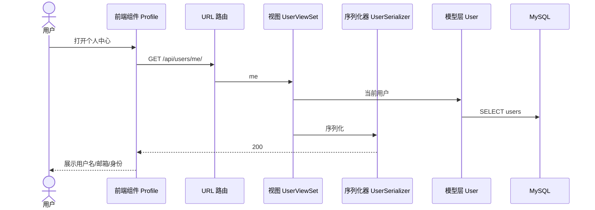

## UC14 管理员后台管理（COMP-SEQ14）

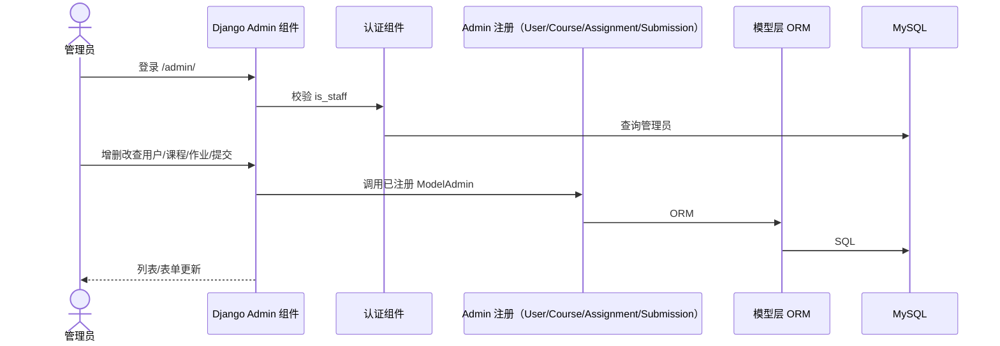

---

## 编号对照

| 用例 | 组件级 | 用例 | 组件级 |
|---|---|---|---|
| UC01 | COMP-SEQ01 | UC08 | COMP-SEQ08 |
| UC02 | COMP-SEQ02 | UC09 | COMP-SEQ09 |
| UC03 | COMP-SEQ03 | UC10 | COMP-SEQ10 |
| UC04 | COMP-SEQ04 | UC11 | COMP-SEQ11 |
| UC05 | COMP-SEQ05 | UC12 | COMP-SEQ12 |
| UC06 | COMP-SEQ06 | UC13 | COMP-SEQ13 |
| UC07 | COMP-SEQ07 | UC14 | COMP-SEQ14 |
