# 对象级顺序图（详细设计说明书）

- **版本**：v1.0　**日期**：2026-08-29
- **范围**：用例清单 UC01~UC14 各 1 张，编号 OBJ-SEQ01 ~ OBJ-SEQ14
- **说明**：在组件级顺序图（COMP-SEQ）基础上展开到类与关键方法，对应 `views.py`、`serializers.py`、`permissions.py`、`models.py`。

---

## UC01 用户注册（OBJ-SEQ01）

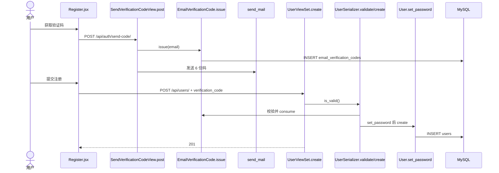

## UC02 用户登录（OBJ-SEQ02）

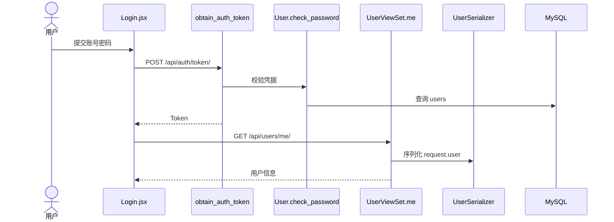

## UC03 浏览课程列表与详情（OBJ-SEQ03）

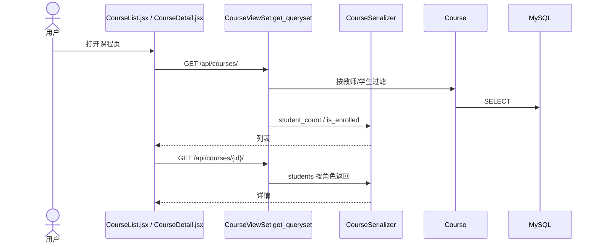

## UC04 学生选课 / 退课（OBJ-SEQ04）

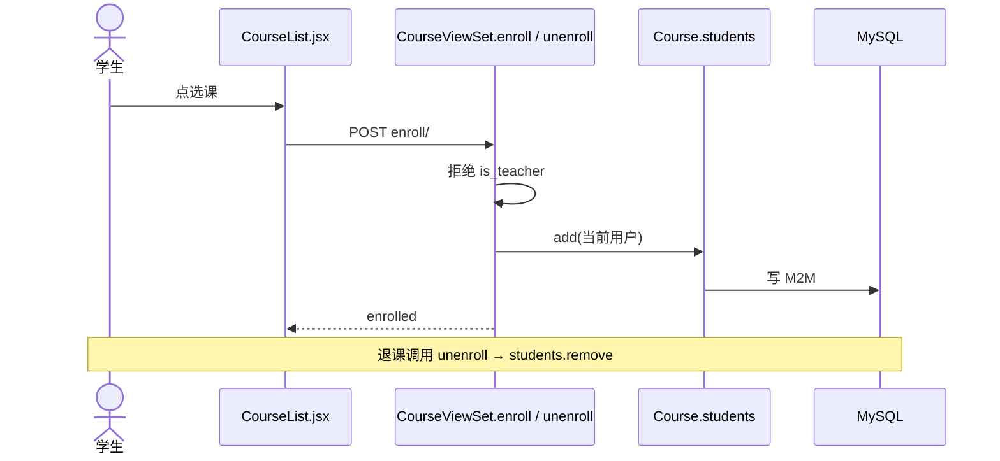

## UC05 教师创建课程（OBJ-SEQ05）

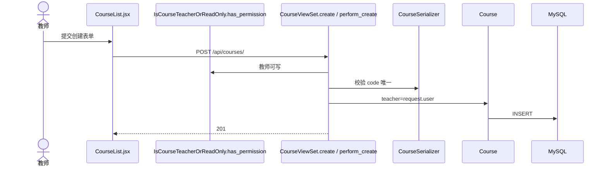

## UC06 教师编辑 / 删除课程（OBJ-SEQ06）

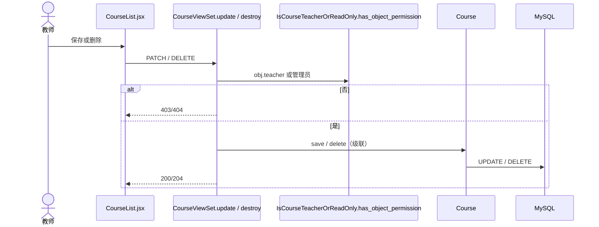

## UC07 教师管理作业（OBJ-SEQ07）

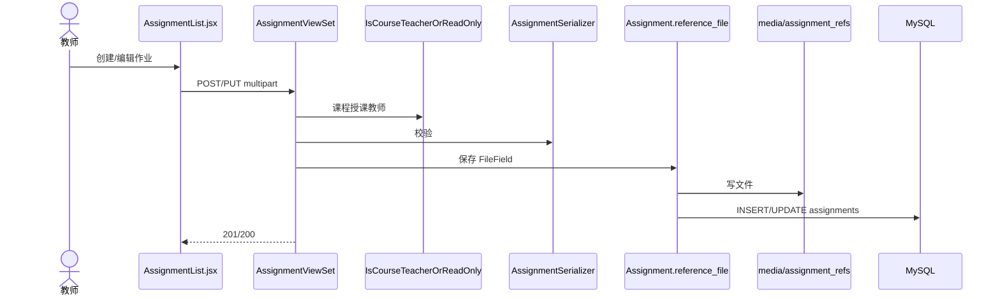

## UC08 查看作业详情并下载参考文档（OBJ-SEQ08）

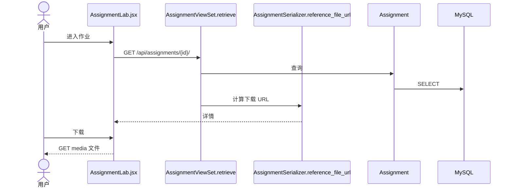

## UC09 学生提交作业（OBJ-SEQ09）

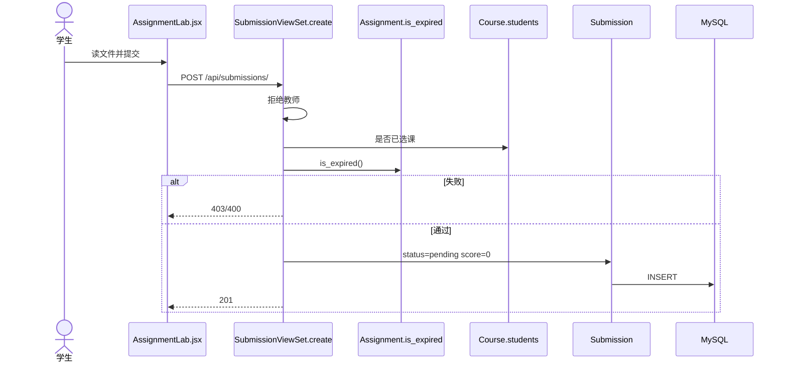

## UC10 学生查看个人提交记录（OBJ-SEQ10）

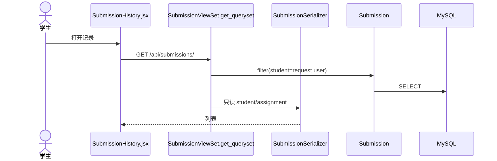

## UC11 教师查看某作业全部提交（OBJ-SEQ11）

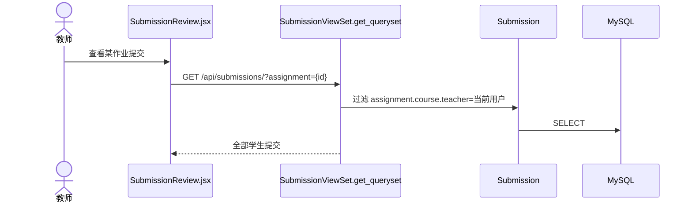

## UC12 教师评分（OBJ-SEQ12）

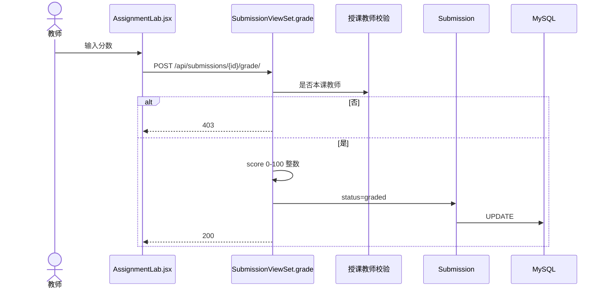

## UC13 查看个人信息（OBJ-SEQ13）

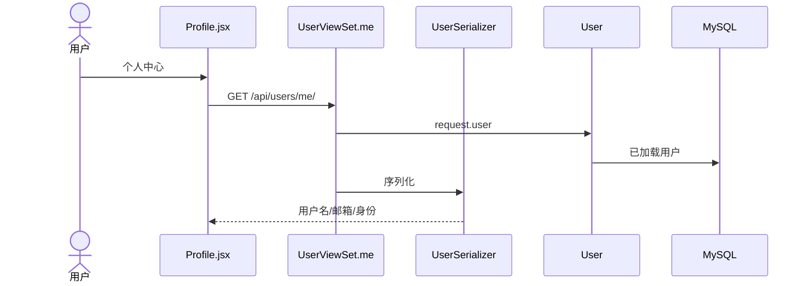

## UC14 管理员后台管理（OBJ-SEQ14）

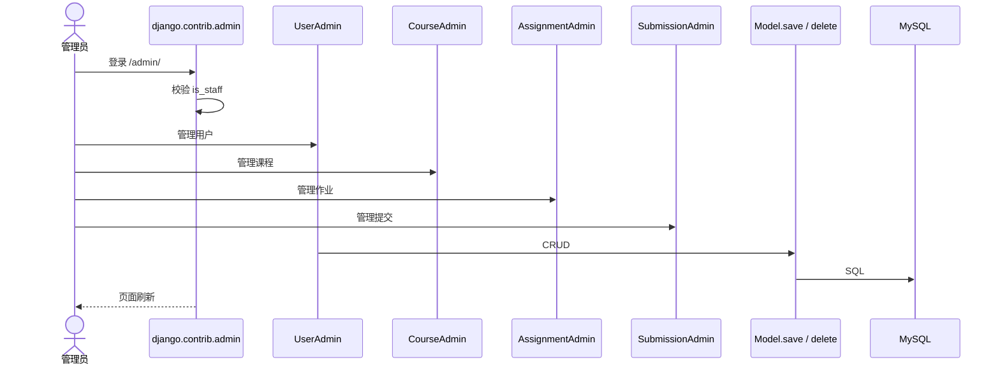

---

## 编号对照

| 用例 | 对象级 | 用例 | 对象级 |
|---|---|---|---|
| UC01 | OBJ-SEQ01 | UC08 | OBJ-SEQ08 |
| UC02 | OBJ-SEQ02 | UC09 | OBJ-SEQ09 |
| UC03 | OBJ-SEQ03 | UC10 | OBJ-SEQ10 |
| UC04 | OBJ-SEQ04 | UC11 | OBJ-SEQ11 |
| UC05 | OBJ-SEQ05 | UC12 | OBJ-SEQ12 |
| UC06 | OBJ-SEQ06 | UC13 | OBJ-SEQ13 |
| UC07 | OBJ-SEQ07 | UC14 | OBJ-SEQ14 |
