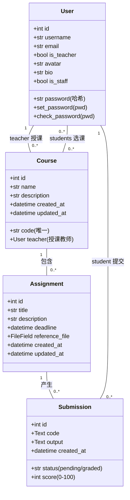
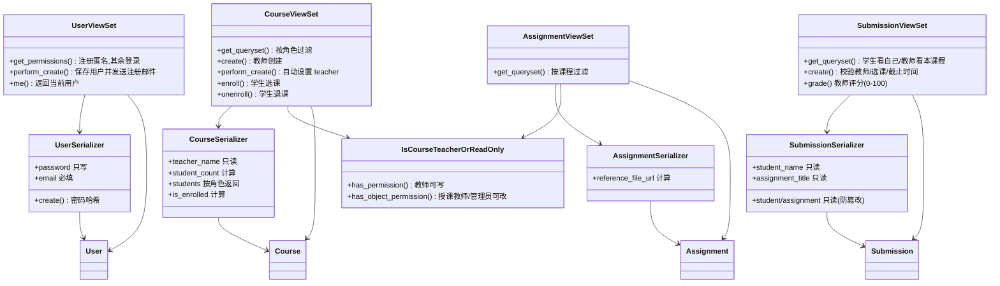

# 类图（详细设计说明书）

- **版本**：v1.1　**日期**：2026-08-26（v1.1：移除 Assignment.test_cases 预留字段）
- **说明**：两张图——① 领域模型类图（对应数据库表结构）；② 后端设计类图（Django/DRF 分层实现）。对象级顺序图见同目录 `对象级顺序图.md`（OBJ-SEQ01~14）。

## 1. 领域模型类图

### 表结构对应（MySQL `online_teach`）

| 表 | 关键字段 | 关系 |
|---|---|---|
| users | id, username(唯一), email, password, is_teacher, avatar, bio, is_staff | 1-N 授课课程；M-N 选课；1-N 提交 |
| courses | id, name, code(唯一), description, teacher_id, created_at, updated_at | N-1 教师；M-N 学生；1-N 作业 |
| assignments | id, course_id, title, description, deadline, reference_file, created_at | N-1 课程；1-N 提交 |
| submissions | id, assignment_id, student_id, code, status, score, output, created_at | N-1 作业；N-1 学生 |

## 2. 后端设计类图（Django/DRF 分层）

### 关键设计说明

1. **权限分层**：`IsCourseTeacherOrReadOnly` 同时挂在课程与作业 ViewSet 上；`has_permission` 控制"创建"，`has_object_permission` 控制"修改/删除"，通过 `obj.course.teacher` 兼容两类对象（今日修复）。
2. **提交创建**：`SubmissionViewSet.create` 不走序列化器默认流程，显式校验"非教师 + 已选课 + 未过期"后创建 `pending` 记录（今日修复）。
3. **字段防篡改**：`SubmissionSerializer` 将 `student`/`assignment` 设为只读，防止 PATCH 挪动提交归属（今日修复）。
4. **注册邮件**：`UserSerializer.create` 负责密码哈希；`UserViewSet.perform_create` 在保存成功后发送通知邮件，失败仅记日志。
5. **参考文档**：`Assignment.reference_file` 为 FileField，序列化时提供 `reference_file_url` 供前端下载。
