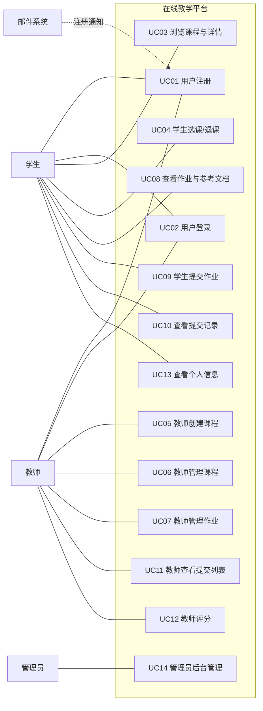

# 在线教学平台 —— 业务场景（用例）清单

- **项目**：在线教学与实训平台（沿用上学期小组项目）
- **文档版本**：v1.1
- **日期**：2026-08-26（v1.1 修订：UC14 删除，UC04 退课 / UC06 课程编辑删除前端入口补齐）
- **状态**：待教师/助教确认（确认后即为最终验收范围）

## 1. 系统概述

在线教学平台为教师与学生提供课程、作业与提交评分的一体化管理。教师创建课程和作业，学生选课后提交作业答案，教师在线评分，学生查看成绩。

- 前端：React 18 + Vite + Ant Design（`web_frontend/`）
- 后端：Django 6 + Django REST Framework + MySQL（`web_backend/`）
- 技术栈特点：Token 认证、文件上传（参考文档）、注册成功邮件通知

## 2. 参与者

| 角色 | 说明 |
|---|---|
| 学生（Student） | 注册、选课、提交作业、查看成绩 |
| 教师（Teacher） | 注册（勾选教师身份）、创建课程/作业、查看提交、评分 |
| 管理员（Admin） | 通过 Django 后台管理用户、课程、作业、提交数据 |
| 邮件系统（外部系统） | 接收注册成功通知邮件（SMTP） |

## 3. 用例图

## 4. 用例清单总览

| 编号 | 用例名称 | 参与者 | 当前状态 | 是否计入验收 |
|---|---|---|---|---|
| UC01 | 用户注册（学生/教师） | 学生、教师 | ✅ 已实现（今日新增邮件通知） | 是 |
| UC02 | 用户登录 | 学生、教师 | ✅ 已实现 | 是 |
| UC03 | 浏览课程列表与课程详情 | 学生、教师 | ✅ 已实现 | 是 |
| UC04 | 学生选课 / 退课 | 学生 | ✅ 已实现（含前端退课入口） | 是 |
| UC05 | 教师创建课程 | 教师 | ✅ 已实现 | 是 |
| UC06 | 教师编辑 / 删除课程 | 教师 | ✅ 已实现（含前端编辑/删除入口） | 是 |
| UC07 | 教师创建 / 编辑 / 删除作业（含参考文档） | 教师 | ✅ 已实现 | 是 |
| UC08 | 查看作业详情并下载参考文档 | 学生、教师 | ✅ 已实现 | 是 |
| UC09 | 学生提交作业（上传文件） | 学生 | ✅ 已实现（含选课、截止时间校验） | 是 |
| UC10 | 学生查看个人提交记录与得分 | 学生 | ✅ 已实现 | 是 |
| UC11 | 教师查看某作业的全部提交 | 教师 | ✅ 已实现 | 是 |
| UC12 | 教师评分（0-100） | 教师 | ✅ 已实现 | 是 |
| UC13 | 查看个人信息 | 学生、教师 | ✅ 已实现 | 是 |
| UC14 | 管理员后台管理 | 管理员 | ✅ 已实现（Django Admin） | 是 |

> **v1.1 修订说明（2026-08-26）：**
> 1. **UC14（系统自动评测）已删除**：原系统从未开发，评测相关代码（`apps/tasks.py` Celery+Docker 任务雏形、`Assignment.test_cases` 字段、评测状态 running/success/failed/error）已一并移除。
> 2. **UC04 前端退课入口已补齐**：课程卡片对已选课学生显示"退课"按钮（Popconfirm 二次确认），调用 `POST /api/courses/{id}/unenroll/`。
> 3. **UC06 前端编辑/删除入口已补齐**：课程卡片对授课教师显示"编辑"（PATCH）/ "删除"（DELETE，Popconfirm 确认，级联删除作业与提交）按钮。

## 5. 用例详细说明

编号规则遵循任务书：`REQ01/UC01 → SYS-SEQ01 → COMP-SEQ01 → OBJ-SEQ01 → UNIT-TC01 → INT-TC01 → E2E-TC01`（三层图与追溯表在后续阶段补齐）。

### UC01 用户注册（REQ01）

- **参与者**：学生、教师
- **触发条件**：新用户在登录页点击"立即注册"
- **前置条件**：用户名未被占用；邮箱有效；密码已设置
- **主成功流程**：
  1. 用户填写用户名、邮箱、密码，选择身份（学生/教师）
  2. 系统校验并创建账号（密码哈希存储）
  3. 系统向注册邮箱发送"注册成功"通知邮件
  4. 页面提示注册成功，跳转登录页
- **备选/异常流程**：
  - 用户名已存在 → 返回 400，提示注册失败
  - 邮箱缺失或格式非法 → 返回 400
  - 邮件发送失败 → 注册仍成功，后端记录告警日志（不阻塞注册）
- **可验证结果**：新账号可登录；邮箱收到通知邮件（开发环境邮件打印在终端）
- **代码位置**：`web_backend/apps/views.py`（UserViewSet.perform_create）、`serializers.py`（UserSerializer）
- **测试**：`tests.py` RegistrationEmailTest（3 例）、冒烟测试 UC01

### UC02 用户登录（REQ02）

- **参与者**：学生、教师
- **触发条件**：用户在登录页输入用户名和密码
- **前置条件**：账号已注册
- **主成功流程**：系统校验密码，签发 Token，前端获取用户信息并进入课程页
- **备选/异常流程**：用户名或密码错误 → 返回 400，提示"用户名或密码错误"
- **可验证结果**：携带 Token 可访问受保护接口；错误密码被拒绝
- **代码位置**：`web_backend/web_backend/urls.py`（/api/auth/token/）、`web_frontend/src/pages/Login.jsx`
- **测试**：冒烟测试 UC02

### UC03 浏览课程列表与课程详情（REQ03）

- **参与者**：学生、教师
- **触发条件**：登录后进入"我的课程"页面，或点击课程卡片
- **前置条件**：已登录
- **主成功流程**：系统返回全部课程（名称、编号、教师、学生数、当前用户选课状态），用户点击查看详情（含学生列表）
- **备选/异常流程**：课程不存在 → 404
- **可验证结果**：列表与详情数据与库中一致；is_enrolled 标记正确
- **代码位置**：`views.py`（CourseViewSet）、`serializers.py`（CourseSerializer）、`web_frontend/src/pages/CourseList.jsx`、`CourseDetail.jsx`
- **测试**：冒烟测试 UC04

### UC04 学生选课 / 退课（REQ04）

- **参与者**：学生
- **触发条件**：学生在课程卡片点击"选课"或"退课"
- **前置条件**：已登录；非教师身份；尚未选该课（选课）
- **主成功流程**：系统将当前用户加入课程学生名单，列表标记变为"我选的"
- **备选/异常流程**：
  - 教师点击选课 → 400"教师不能选课"
  - 重复选课 → 幂等，不报错
  - 退课 → 从学生名单移除（前端"退课"按钮 + Popconfirm 二次确认）
- **可验证结果**：课程详情学生列表变化；is_enrolled 状态更新
- **代码位置**：`views.py`（enroll/unenroll action）、`web_frontend/src/pages/CourseList.jsx`
- **测试**：`tests.py` CoursePermissionTest.test_enroll_still_works_for_student / test_student_can_unenroll、冒烟测试 UC05

### UC05 教师创建课程（REQ05）

- **参与者**：教师
- **触发条件**：教师点击"创建课程"并填写名称、编号、描述
- **前置条件**：已登录且为教师身份；课程编号不重复
- **主成功流程**：系统创建课程，创建者自动成为授课教师，课程出现在列表中
- **备选/异常流程**：编号重复 → 400；学生创建 → 403
- **可验证结果**：新课程出现在课程列表，教师身份为创建者
- **代码位置**：`views.py`（CourseViewSet.create/perform_create）、`CourseList.jsx`
- **测试**：冒烟测试 UC03

### UC06 教师编辑 / 删除课程（REQ06）

- **参与者**：教师
- **触发条件**：教师在"我的课程"页对自己课程的卡片点击"编辑"或"删除"
- **前置条件**：已登录；为课程授课教师（或管理员）
- **主成功流程**：编辑弹窗（名称/编号/描述）PATCH /api/courses/{id}/ 成功；删除经 Popconfirm 确认后 DELETE 成功
- **备选/异常流程**：非授课教师 → 403/404；删除级联删除作业与提交；课程编号重复 → 400
- **可验证结果**：接口返回 200/204；列表数据变更生效
- **代码位置**：`views.py`（CourseViewSet）、`permissions.py`（IsCourseTeacherOrReadOnly）、`web_frontend/src/pages/CourseList.jsx`
- **测试**：`tests.py` CoursePermissionTest（编辑 1 例 + 删除 3 例）

### UC07 教师创建 / 编辑 / 删除作业（含参考文档）（REQ07）

- **参与者**：教师
- **触发条件**：教师在课程下点击"新建作业"，填写标题、描述、截止时间，可上传参考文档（pdf/doc/图片等）
- **前置条件**：已登录；为该课程授课教师；截止时间已填
- **主成功流程**：作业创建成功并显示在作业列表（含"进行中/已截止"状态标签）；可编辑（含替换参考文档）、可删除
- **备选/异常流程**：
  - 非授课教师编辑/删除 → 403
  - 学生创建 → 403
- **可验证结果**：作业列表、详情数据正确；参考文档可下载
- **代码位置**：`views.py`（AssignmentViewSet）、`models.py`（Assignment.reference_file）、`AssignmentList.jsx`
- **测试**：`tests.py` AssignmentPermissionTest（3 例）、冒烟测试 UC06

### UC08 查看作业详情并下载参考文档（REQ08）

- **参与者**：学生、教师
- **触发条件**：用户在作业列表点击"进入作业"
- **前置条件**：已登录
- **主成功流程**：页面展示作业描述、截止时间，如有参考文档可点击下载
- **可验证结果**：详情正确；参考文档链接可访问
- **代码位置**：`AssignmentLab.jsx`、`serializers.py`（AssignmentSerializer）
- **测试**：冒烟测试 UC07

### UC09 学生提交作业（REQ09）

- **参与者**：学生
- **触发条件**：学生在作业页选择文本文件（.py/.txt/.md/.java 等），点击"提交作业"
- **前置条件**：已登录；**已选该课程**；**未过截止时间**；非教师身份
- **主成功流程**：文件内容作为答案提交，生成"待评分"（pending）记录，提示提交成功
- **备选/异常流程**：
  - 未选课 → 403"请先选课再提交作业"
  - 已截止 → 400"作业已截止，无法提交"
  - 教师提交 → 403"教师不能提交作业"
  - 未上传文件 → 前端拦截提示
- **可验证结果**：提交记录出现在学生与教师的提交列表中，状态为 pending
- **代码位置**：`views.py`（SubmissionViewSet.create，今日修复）、`AssignmentLab.jsx`
- **测试**：`tests.py` SubmissionCreateTest（4 例）、冒烟测试 UC08

### UC10 学生查看个人提交记录与得分（REQ10）

- **参与者**：学生
- **触发条件**：学生进入"提交记录"页或作业页的"提交记录"标签
- **前置条件**：已登录
- **主成功流程**：系统返回该学生的全部提交（或按作业过滤），展示提交时间、状态、得分
- **备选/异常流程**：无提交 → 显示"暂无提交记录"空状态
- **可验证结果**：只能看到自己的提交；按作业过滤不串作业
- **代码位置**：`views.py`（SubmissionViewSet.get_queryset）、`SubmissionHistory.jsx`、`AssignmentLab.jsx`
- **测试**：`tests.py` SubmissionUpdateTest、冒烟测试 UC09

### UC11 教师查看某作业的全部提交（REQ11）

- **参与者**：教师
- **触发条件**：教师在作业列表点击"查看提交"或进入作业页"提交记录"标签
- **前置条件**：已登录；为该课程授课教师
- **主成功流程**：系统返回该作业下全部学生的提交（学生、时间、状态、得分），可查看答案详情
- **备选/异常流程**：非授课教师 → 查不到其他教师课程的提交
- **可验证结果**：列表包含全部学生提交，含未评分项
- **代码位置**：`views.py`（SubmissionViewSet.get_queryset）、`SubmissionReview.jsx`
- **测试**：冒烟测试 UC10

### UC12 教师评分（REQ12）

- **参与者**：教师
- **触发条件**：教师在评分弹窗输入 0-100 分并保存
- **前置条件**：已登录；为该作业所属课程授课教师
- **主成功流程**：提交状态变为"已评分"（graded），得分更新，学生端可见
- **备选/异常流程**：
  - 学生评分 → 403
  - 分数非 0-100 整数 → 400
  - 非授课教师 → 403/404
- **可验证结果**：提交状态/得分在教师与学生列表中都正确显示
- **代码位置**：`views.py`（grade action）、`AssignmentLab.jsx`、`SubmissionReview.jsx`
- **测试**：`tests.py`（评分相关）、冒烟测试 UC11

### UC13 查看个人信息（REQ13）

- **参与者**：学生、教师
- **触发条件**：用户点击右上角头像进入"个人中心"
- **前置条件**：已登录
- **主成功流程**：展示用户名、邮箱、身份（教师/学生）
- **可验证结果**：信息与账号一致
- **代码位置**：`views.py`（users/me）、`Profile.jsx`
- **测试**：冒烟测试 UC12

### UC14 管理员后台管理（REQ14）

- **参与者**：管理员
- **触发条件**：管理员登录 /admin/ 后台
- **主成功流程**：管理用户（含教师标记）、课程（含学生名单）、作业、提交记录
- **可验证结果**：后台数据与前台一致，变更生效
- **代码位置**：`web_backend/apps/admin.py`
- **测试**：人工验证（后续补自动化）

## 6. 第一天验证结果

| 验证项 | 结果 | 证据 |
|---|---|---|
| 后端启动 | ✅ | Django dev server 正常响应 |
| 前端启动 | ✅ | Vite dev server HTTP 200 |
| 前后端联通（vite 代理 → Django） | ✅ | /api 经代理返回认证拒绝（链路通） |
| 全量自动化测试 | ✅ 18/18 | `python manage.py test apps`（v1.1 新增退课/编辑课程 2 例） |
| 端到端冒烟测试（逐用例走 API） | ✅ 32/32 | `04_tests/smoke/day1_smoke_api.py`（含异常流程） |
| 注册成功邮件 | ✅ | Django 测试 mail.outbox 验证（开发环境控制台输出） |
| 环境依赖 | ✅ | Python 3.12 / Node 24 / MySQL 8 就绪 |

## 7. 待教师/助教确认清单（v1.1 更新）

1. 本清单（UC01~UC14，UC14 自动评测已删除）是否覆盖全部业务场景？是否有遗漏或误计入的用例？
2. UC04 退课、UC06 课程编辑/删除的前端入口已于 v1.1 补齐，请一并确认。
3. 确认后本清单即为最终验收范围，后续补充三层模型图、追溯表。

## 8. 后续计划（与任务书对应）

- 8/25-8/28：补齐需求/设计文档（用例图已完成，补概念类图、顺序图等）、三层图、追溯表；补单元/集成/端到端测试；Docker 化与 CI
- 8/29 中期检查
- 8/31-9/3：拆 3 个以上业务微服务、Kubernetes 部署、扩缩容/故障实验、性能对比
- 9/4：答辩与演示
