# 系统级顺序图（需求说明书）

- **版本**：v1.1　**日期**：2026-08-26（v1.1：UC14 自动评测删除，UC15 顺延为 UC14，编号 SYS-SEQ01 ~ SYS-SEQ14）
- **范围**：用例清单（`业务场景用例清单_v1.md`）中每个用例 1 张系统级顺序图，对应编号 SYS-SEQ01 ~ SYS-SEQ14
- **图例**：参与者（Actor）为角色；「前端页面」「后端 API」「MySQL」为系统内部子系统（系统边界内）；「邮件系统」为外部系统
- **说明**：本阶段为系统级（黑盒），仅表现参与者与系统间的交互，不展开内部类级细节

---

## UC01 用户注册（SYS-SEQ01）

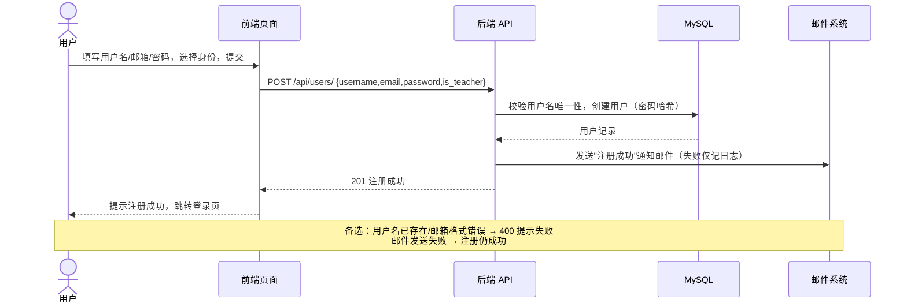

## UC02 用户登录（SYS-SEQ02）

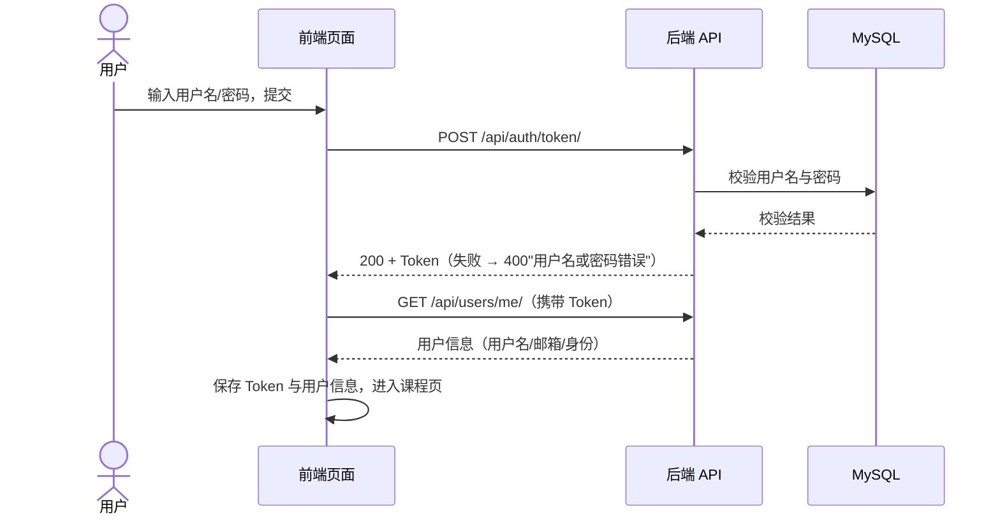

## UC03 浏览课程列表与课程详情（SYS-SEQ03）

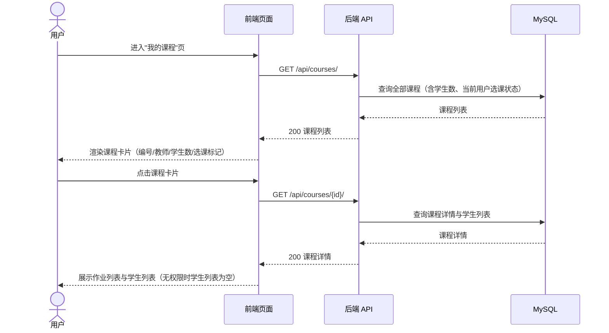

## UC04 学生选课 / 退课（SYS-SEQ04）

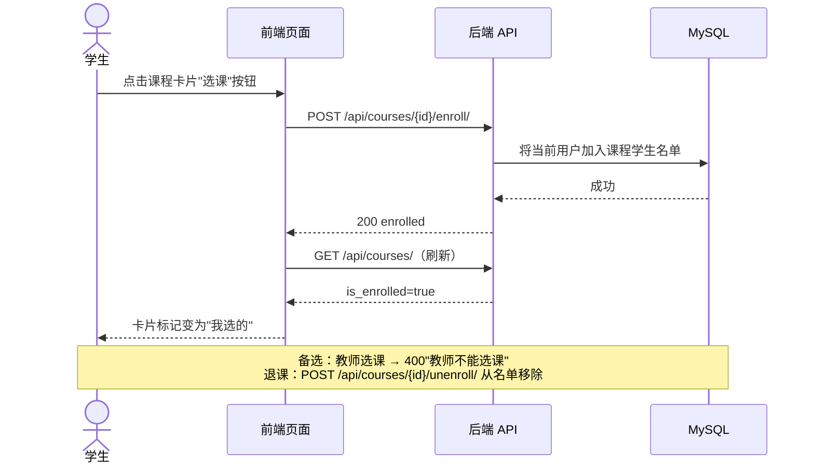

## UC05 教师创建课程（SYS-SEQ05）

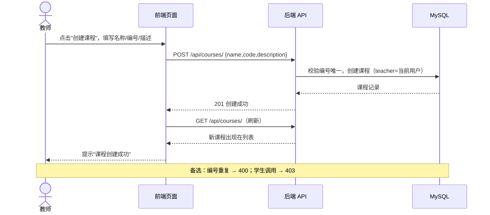

## UC06 教师编辑 / 删除课程（SYS-SEQ06）

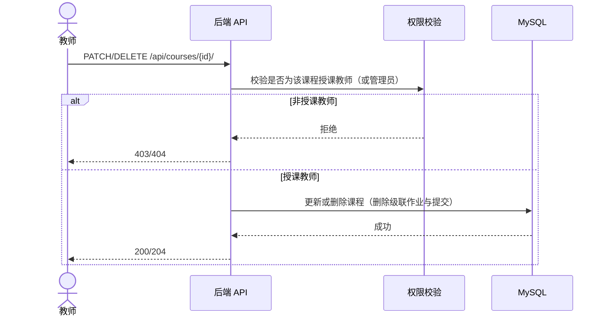

## UC07 教师管理作业（创建 / 编辑 / 删除，含参考文档）（SYS-SEQ07）

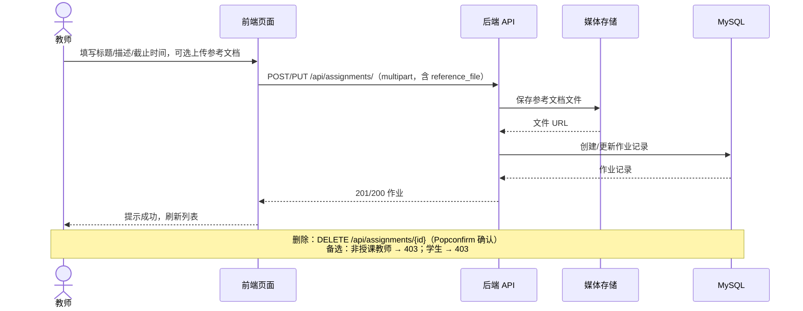

## UC08 查看作业详情并下载参考文档（SYS-SEQ08）

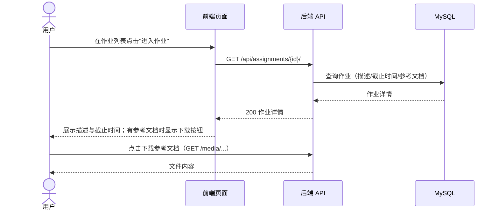

## UC09 学生提交作业（SYS-SEQ09）

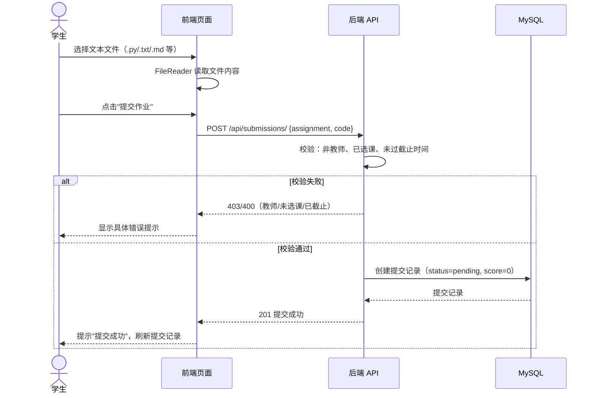

## UC10 学生查看个人提交记录（SYS-SEQ10）

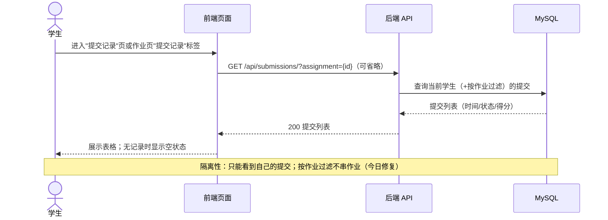

## UC11 教师查看某作业的全部提交（SYS-SEQ11）

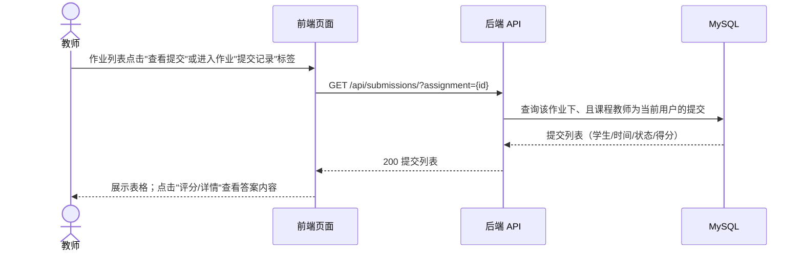

## UC12 教师评分（SYS-SEQ12）

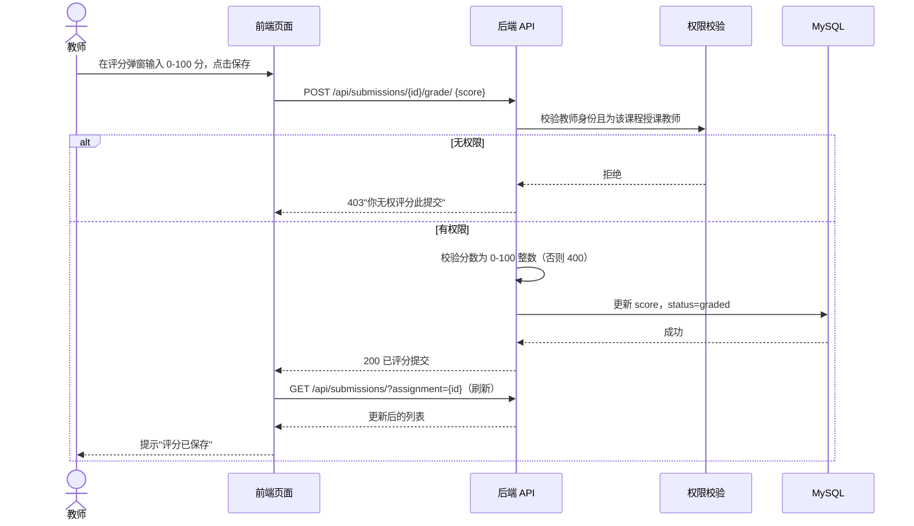

## UC13 查看个人信息（SYS-SEQ13）

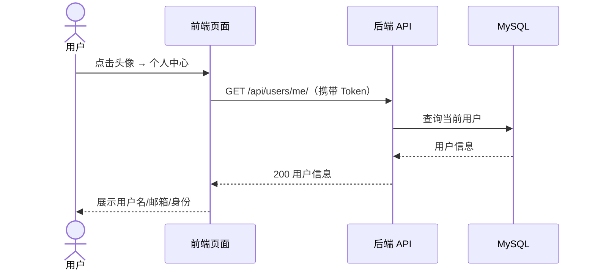

## UC14 管理员后台管理（SYS-SEQ14）

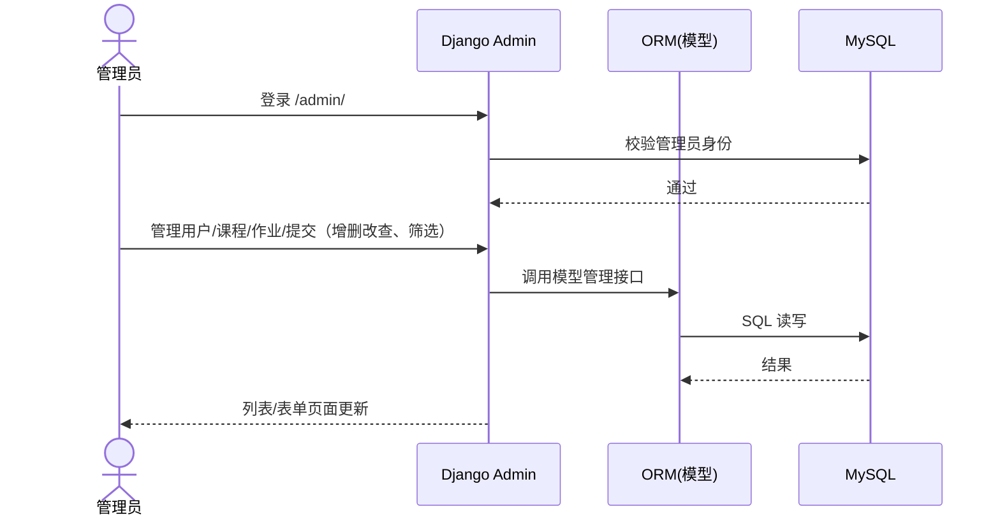

---

## 编号对照表

| 用例 | 系统级顺序图 | 用例 | 系统级顺序图 |
|---|---|---|---|
| UC01 | SYS-SEQ01 | UC08 | SYS-SEQ08 |
| UC02 | SYS-SEQ02 | UC09 | SYS-SEQ09 |
| UC03 | SYS-SEQ03 | UC10 | SYS-SEQ10 |
| UC04 | SYS-SEQ04 | UC11 | SYS-SEQ11 |
| UC05 | SYS-SEQ05 | UC12 | SYS-SEQ12 |
| UC06 | SYS-SEQ06 | UC13 | SYS-SEQ13 |
| UC07 | SYS-SEQ07 | UC14 | SYS-SEQ14 |
