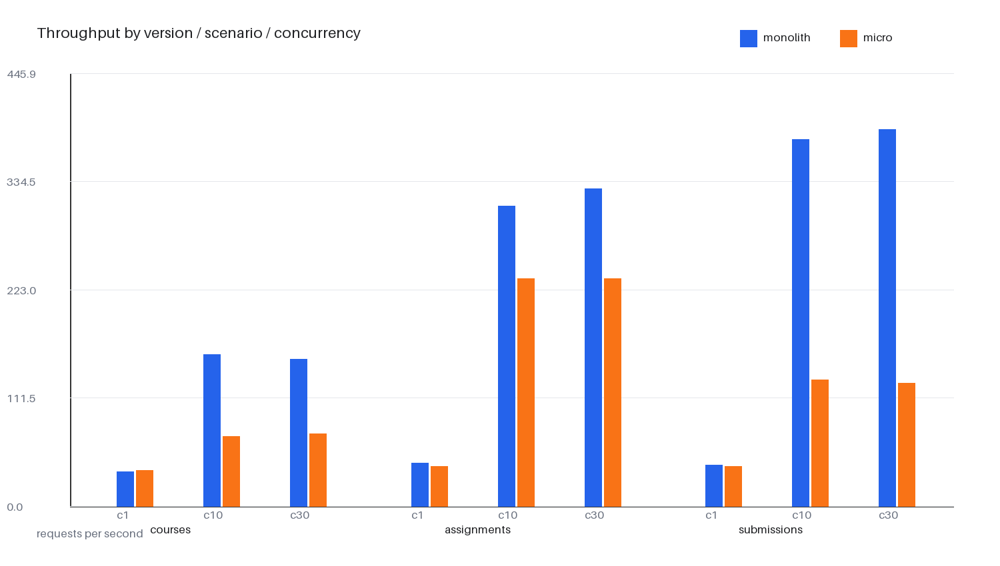
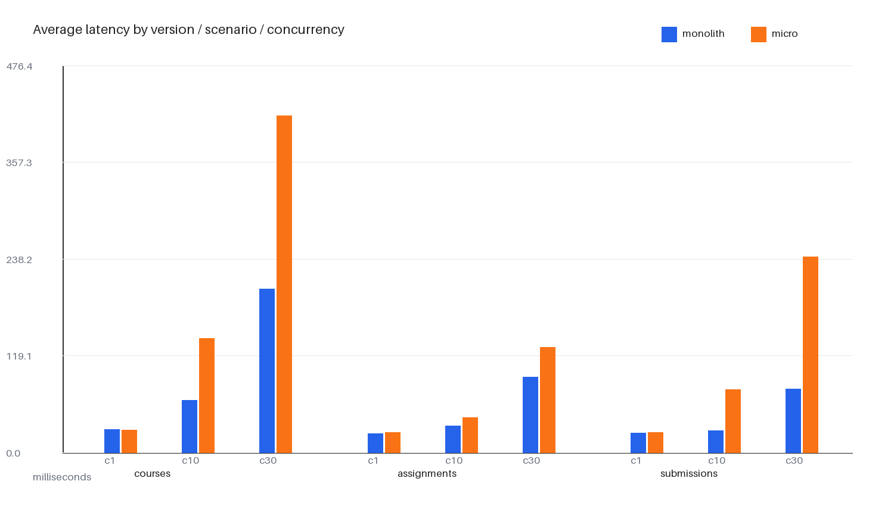
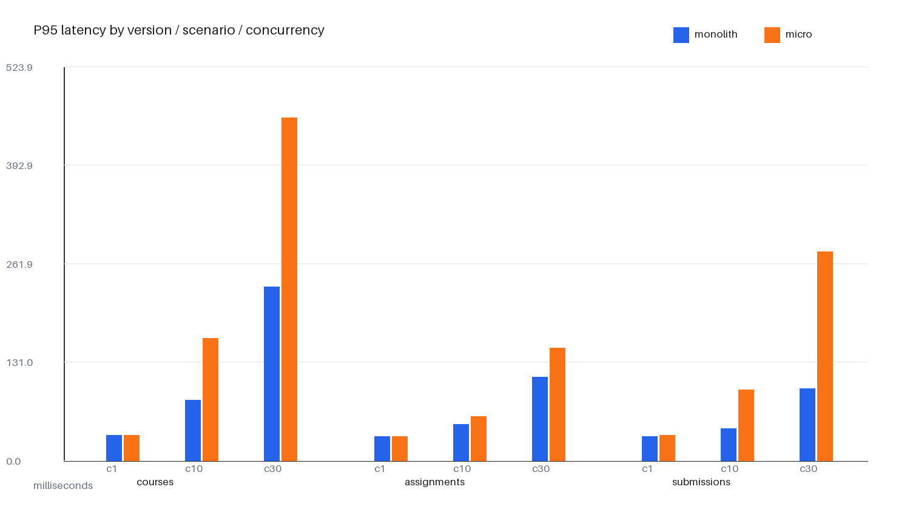

# 单体版 vs 微服务版性能对比报告

## 1. 实验结论

本次实验在同一台 Windows 机器上，使用同一批演示数据、同一个 `load_test.py` 脚本和相同的请求条件，对单体版和微服务版各完成 27 次运行（3 个接口 × 3 个并发级别 × 3 次重复），共 54 份原始结果。所有请求均返回 HTTP 2xx，原始结果中的错误率均为 0。

微服务版没有在本次单机、固定副本数实验中全面胜出：课程列表接口在并发 10/30 时，微服务版受 Nginx 网关和课程服务补全用户信息的跨服务 HTTP 调用影响，平均响应时间和 P95 明显高于单体版；作业列表在微服务版也有稳定的网关开销；教师查询提交列表还需要跨服务圈定课程范围和补全学生信息，在并发 10/30 时延迟明显高于单体版。该结果是实测结果，不应表述为微服务性能提升。

微服务架构的性能优势不在本次固定规模单机测试中体现，后续可在 Kubernetes HPA 扩容或服务独立扩容实验中继续观察高负载下的弹性和资源隔离能力。

## 2. 实验条件

| 项目 | 值 |
|---|---|
| 主机 | Windows / Docker Desktop 29.3.1 / 16 CPU / 约 16 GiB 内存 |
| 单体入口 | `http://127.0.0.1:8080`，Compose 项目 `otp-monolith` |
| 微服务入口 | `http://127.0.0.1:8081`，Compose 项目 `otp-micro`，网关调试端口 8001 |
| 数据 | 两套独立 MySQL 卷，各执行项目 `seed_data`，课程 ID 1、作业 ID 2 |
| 场景 | `GET /api/courses/`；`GET /api/assignments/?course=1`；`GET /api/submissions/?assignment=2` |
| 并发 | 1、10、30 |
| 每次运行 | 预热 5 秒，测量 15 秒 |
| 重复次数 | 每场景/并发/版本 3 次 |
| 认证 | 演示教师账号 JWT，仅在本机命令行使用，未写入仓库；教师提交列表路径覆盖跨服务课程范围校验 |

## 3. 汇总数据

完整汇总见 [`性能对比汇总.md`](性能对比汇总.md) 和 [`性能对比汇总.csv`](性能对比汇总.csv)。以下图表由原始 JSON 自动生成：







## 4. 原始材料与复现命令

原始结果文件共 54 份（单体 27 份、微服务 27 份）；原始错误率集合均为 0（共 54 份）。文件位于 `04_tests/performance/raw/`。

```powershell
python 04_tests/performance/load_test.py --base-url http://127.0.0.1:8080 --token <token> --scenario courses --concurrency 10 --duration 15 --warmup 5 --containers otp-backend,otp-mysql,otp-frontend --output 04_tests/performance/raw/monolith_courses_c10_r1.json
python 04_tests/performance/load_test.py --base-url http://127.0.0.1:8081 --token <token> --scenario courses --concurrency 10 --duration 15 --warmup 5 --containers otp-micro-user,otp-micro-course,otp-micro-assignment,otp-micro-gateway,otp-micro-mysql,otp-micro-frontend --output 04_tests/performance/raw/micro_courses_c10_r1.json
python 04_tests/performance/summarize.py
python 04_tests/performance/generate_report.py
```

## 5. 解释与限制

- 单体版和微服务版不是同一进程数：单体后端使用 Compose 默认 2 个 gunicorn worker；微服务版每个业务服务使用默认 1 个 worker。本报告保留这一真实部署差异，并在答辩中说明。
- CPU 和内存是测试期间指定容器的合计采样平均值/峰值，不是宿主机全局利用率。微服务版采样包含 6 个容器，单体版包含 3 个容器，因此资源总量不可简单用作单服务效率结论。
- 测试入口都经过前端 Nginx；单体版由前端 Nginx 反代到后端，微服务版由前端 Nginx 再转到 API 网关和业务服务。两边保持相同的外部入口层级。
- 本次实验固定副本数、单机运行，不能证明 Kubernetes 扩缩容后的性能；扩缩容结论应引用单独的 HPA 实验记录。

## 6. 验收检查

- [x] 2～3 个主要接口
- [x] 同一台机器、同一批数据、同一份压力脚本
- [x] 单体/微服务每个条件至少运行 3 次
- [x] 并发数、吞吐量、平均响应时间、P95、错误率、CPU、内存均有记录
- [x] 原始 JSON、CSV 汇总、Markdown 报告和图表均已保存
- [x] 结果不夸大，明确说明微服务版在本次条件下较慢的原因
