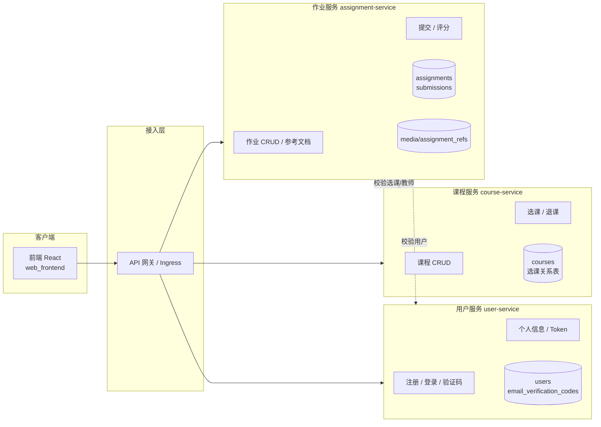

# 在线教学平台 · 中期检查汇报

**小组**：杨任宇班-17组  
**日期**：2026-08-29  
**仓库**：https://github.com/jijia-hui/-  
**分支**：`check8.27`  
**最新提交**：`39107cb`（8/29）；8/28 主要提交 `7f4b73d`

---

## 一、中期检查要求回顾

| 编号 | 检查项 | 状态 |
|:---:|---|:---:|
| 1 | 所有业务场景（用例）能运行，已打 Git 标签 | 完成 |
| 2 | 需求说明书、概要设计、详细设计、追溯表已完成 | 完成 |
| 3 | 前端 / 后端 / 数据库容器能启动，CI 自动构建测试 | 完成 |
| 4 | 微服务划分图、接口清单、数据表归属方案已完成 | 完成 |

以下提交记录为以上各项要求的完成提供证据。

---

## 二、提交记录总览

| 日期 | 提交 | 提交信息 | 对应要求 |
|---|---|---|:---:|
| 8/29 | `b32ad39` | 完善 8/28 交付记录：站会简报与中期检查汇报 | 管理 |
| 8/29 | `39107cb` | 补齐组件/对象级顺序图、追溯表 v1.3 | 2 |
| 8/28 | `39107cb` | 看板重构、统计页面、站会简报（T-P-04） | 管理 |
| 8/28 | `7f4b73d` | 邮箱验证码注册、Docker 与 CI/CD 优化，推送 check8.27 | 2 3 |
| 8/27 | `b6f7225` | 修复 CD：kind load 需指定集群名 | 3 |
| 8/27 | `41aa0bc` | 补全 Kubernetes 部署、测试数据与 CD 修复 | 3 4 |
| 8/27 | `4aad907` | 添加容器化部署与 CI/CD 流水线 | 3 |
| 8/26 | `e79bd85` | 邮箱功能完善（后升级为验证码注册） | 2 |
| 8/26 | `c6d3a8a` | 三类测试 | 1 |
| 8/26 | `517aaa6` | 用例确认，代码对齐 | 1 |
| 8/25 | `39c331d` | monolith-start（Git 基线标签） | 1 3 |
| 8/25 | `4771589` | 第一天交付：用例清单、冒烟测试、站会简报 | 1 |
| 8/25 | `d0d2241` | 修复越权漏洞、注册通知、补充测试 | 2 |
| 8/25 | `7af1d41` | 需求 / 概要 / 详细设计说明书 + 追溯表 | 2 |
| 8/25 | `e3c42da` | UI 优化 | 3 |

交付节奏：每日持续提交，关键功能与文档分阶段有序交付。

---

## 8/28（第 4 天）交付说明

### 完成内容

**工程与代码（提交 `7f4b73d`）**

- 注册流程改为邮箱验证码（前后端 + 测试同步更新）
- Docker Compose 健康检查、入口脚本、Nginx 反代优化
- 后端探活接口 `/api/health/`
- 分支 **`check8.27`** 推送至 GitHub，供组内与助教拉取

**项目管理与看板（提交 `39107cb` 中 8/28 完成部分）**

- 重构 GitHub Projects 看板：卡片标题统一为 `[T-编号]`，补充任务编号、Target date、Priority
- 更新仓库内看板文档：`看板.md`、`看板任务清单.md`
- 新增可视化统计页：`统计页面.html`（五列看板 + 指标，供每日截图）
- 提交第 4 天站会简报：`05_management/站会简报/20260828_站会简报.md`
- 看板截图目录与说明：`05_management/看板截图/README.md`

### 对应提交记录

- 提交信息 1（8/28）：「更新 8.27：邮箱验证码注册、Docker 与 CI/CD 优化」— `7f4b73d`
- 提交信息 2（8/28 完成 / 8/29 合入）：「看板重构、统计页面与站会简报」— 见 `39107cb` 中 `05_management/` 相关文件

---

## 三、业务场景与用例交付

### 完成内容

- 完成全部业务用例清单的确认（**UC01~UC14**，范围 v1.1）
- 单元 / 集成 / 端到端三类自动化测试全部执行并通过（**179/179**）
- 端到端冒烟测试已执行并通过（32/32，第 1 天基线）
- 所有用例通过 Git 标签进行版本标记（**monolith-start**）

### 用例与测试覆盖

| 用例 | 业务说明 | 测试 |
|---|---|:---:|
| UC01 | 用户注册（邮箱验证码） | ✅ |
| UC02 | 用户登录 | ✅ |
| UC03 | 浏览课程列表与详情 | ✅ |
| UC04 | 学生选课 / 退课 | ✅ |
| UC05 | 教师创建课程 | ✅ |
| UC06 | 教师编辑 / 删除课程 | ✅ |
| UC07 | 教师管理作业（含参考文档） | ✅ |
| UC08 | 查看作业详情并下载参考文档 | ✅ |
| UC09 | 学生提交作业 | ✅ |
| UC10 | 学生查看个人提交记录 | ✅ |
| UC11 | 教师查看某作业全部提交 | ✅ |
| UC12 | 教师评分 | ✅ |
| UC13 | 查看个人信息 | ✅ |
| UC14 | 管理员后台管理 | ✅ |

测试报告路径：`04_tests/reports/测试报告.md`

### 对应提交记录

- 提交信息 1：「第一天交付：业务用例清单、端到端冒烟测试、站会简报、看板任务清单与交付目录结构」
- 提交信息 2：「三类测试」
- 提交信息 3：「用例确认，代码对齐」
- 提交信息 4：「monolith-start（Git 基线标签）」

---

## 四、架构设计与文档交付

### 完成内容

| 文档类型 | 路径 | 状态 |
|---|---|:---:|
| 需求说明书（用例清单） | `02_docs/需求说明书/业务场景用例清单_v1.md` | 完成 |
| 系统级顺序图 SYS-SEQ01~14 | `02_docs/需求说明书/系统级顺序图.md` | 完成 |
| 概要设计说明书（组件图） | `02_docs/概要设计说明书/组件图.md` | 完成 |
| 组件级顺序图 COMP-SEQ01~14 | `02_docs/概要设计说明书/组件级顺序图.md` | 完成 |
| 详细设计说明书（类图） | `02_docs/详细设计说明书/类图.md` | 完成 |
| 对象级顺序图 OBJ-SEQ01~14 | `02_docs/详细设计说明书/对象级顺序图.md` | 完成 |
| 需求→设计→代码追溯表 v1.3 | `02_docs/追溯表.md` | 完成 |

编号规则：`REQ01/UC01 → SYS-SEQ01 → COMP-SEQ01 → OBJ-SEQ01 → UNIT-TC01 → INT-TC01 → E2E-TC01`

### 代码质量补充

- 修复课程 / 作业越权与授权漏洞
- 注册流程升级为邮箱验证码（6 位码、10 分钟有效）
- 补齐单元 / 集成 / 端到端测试，共 179 项全部通过
- 清理 pyc 缓存文件

### 对应提交记录

- 提交信息 1：「需求说明书，概要设计说明书，详细设计说明书，追溯表」
- 提交信息 2：「修复课程/作业越权与授权漏洞，新增注册邮件通知，补充测试」
- 提交信息 3：「更新 8.27：邮箱验证码注册、Docker 与 CI/CD 优化」（`7f4b73d`，8/28）
- 提交信息 4：「补齐组件/对象级顺序图、追溯表 v1.3」（`39107cb`，8/29）

---

## 五、容器化与 CI/CD

### 完成内容

- 前端、后端、数据库均可容器化启动（Docker Compose）
- 提供前后端 Dockerfile、数据库初始化与迁移脚本、测试数据脚本（`seed_data`）
- Kubernetes 部署配置已完成（`k8s/` 目录）
- CI 流水线可自动完成构建与测试（单元 + 集成 + 端到端）
- CD 流水线可制作版本化镜像并部署到 Kind 集群，含健康检查
- CD 部署问题已修复（kind load 集群名）

### CI/CD 流程

```
代码推送 → GitHub Actions 构建 → 单元/集成/E2E 测试 → 容器镜像生成 → CD 部署到 Kind 集群 → 健康检查
```

任一环节失败即停止，后续部署不继续。

### 启动与访问

```bash
git clone -b check8.27 https://github.com/jijia-hui/-.git
cd -
docker compose up -d --build
docker compose exec backend python manage.py seed_data
```

- 访问地址：http://localhost:8080  
- 健康检查：http://localhost:8080/api/health/  
- 演示账号：教师 `demo_teacher` / 学生 `demo_student`，密码 `Demo@1234`

### 对应提交记录

- 提交信息 1：「添加容器化部署与 CI/CD 流水线」
- 提交信息 2：「修复 CD：kind load 需指定集群名（kind-action 默认 chart-testing）」
- 提交信息 3：「补全 Kubernetes 部署、测试数据与 CD 修复」
- 提交信息 4：「更新 8.27：邮箱验证码注册、Docker 与 CI/CD 优化」（`7f4b73d`，8/28）

---

## 六、微服务划分与数据归属

### 完成内容

- **微服务划分图**：按业务边界拆分为 3 个业务微服务（见下图）
- **服务接口清单**：各服务对外 REST 接口及跨服务内部接口已梳理
- **数据表归属方案**：每张业务表的归属服务已明确，禁止跨服务直连数据库

### 微服务划分图



### 三个业务微服务说明

| 服务 | 职责 | 对应用例 |
|---|---|---|
| user-service | 用户注册（验证码）、登录、Token、个人信息 | UC01、UC02、UC13 |
| course-service | 课程创建/编辑/删除、浏览、选课/退课 | UC03~UC06 |
| assignment-service | 作业管理、提交、评分、参考文档 | UC07~UC12 |

> 说明：API 网关、前端、MySQL 服务器不计入 3 个业务微服务；UC14 管理员后台暂由 user-service 提供 Django Admin 入口。

### 数据表归属方案

| 表 / 存储 | 归属服务 | 其他服务访问方式 |
|---|---|---|
| users | user-service | REST API，禁止直连 |
| email_verification_codes | user-service | 禁止跨服务访问 |
| courses | course-service | REST API |
| courses_students（选课关系） | course-service | assignment-service 提交前调用选课校验接口 |
| assignments | assignment-service | REST API |
| submissions | assignment-service | REST API |
| media/assignment_refs/ | assignment-service | 文件仅本服务读写 |

### 服务接口清单（节选）

**user-service**

| 方法 | 路径 | 说明 |
|---|---|---|
| POST | /api/auth/send-code/ | 发送注册验证码 |
| POST | /api/users/ | 用户注册 |
| POST | /api/auth/token/ | 登录获取 Token |
| GET | /api/users/me/ | 当前用户信息 |

**course-service**

| 方法 | 路径 | 说明 |
|---|---|---|
| GET/POST | /api/courses/ | 课程列表 / 创建 |
| GET/PUT/PATCH/DELETE | /api/courses/{id}/ | 课程详情 / 修改 / 删除 |
| POST | /api/courses/{id}/enroll/ | 选课 |
| POST | /api/courses/{id}/unenroll/ | 退课 |

**assignment-service**

| 方法 | 路径 | 说明 |
|---|---|---|
| GET/POST | /api/assignments/ | 作业列表 / 创建 |
| GET/PUT/PATCH/DELETE | /api/assignments/{id}/ | 作业详情 / 修改 / 删除 |
| GET/POST | /api/submissions/ | 提交列表 / 提交作业 |
| POST | /api/submissions/{id}/grade/ | 教师评分 |

**跨服务内部接口（后阶段实现）**

| 调用方 | 被调方 | 接口 | 用途 |
|---|---|---|---|
| assignment-service | course-service | GET /internal/courses/{id}/enrollment/{userId} | 提交前校验已选课 |
| assignment-service | course-service | GET /internal/courses/{id}/teacher | 评分前校验授课教师 |
| assignment-service | user-service | GET /internal/users/{id} | 校验用户角色 |

### 项目模块结构（当前单体 → 拆分对照）

| 模块 | 路径 | 说明 | 拆分后归属 |
|---|---|---|---|
| 前端 | web_frontend/ | React 单页应用 | 独立部署，经网关访问各服务 |
| 后端（单体） | web_backend/ | Django + DRF 单体 | 8/31 起拆为 user / course / assignment |
| 容器编排 | docker-compose.yml | 本地 Compose | 后阶段改为多服务 Compose |
| K8s 配置 | k8s/ | 部署清单 | 后阶段每服务独立 Deployment |
| CI/CD | .github/workflows/ | GitHub Actions | 后阶段按服务触发构建 |
| 自动化测试 | 04_tests/ | 单元 / 集成 / E2E | 微服务版回归测试 |

### 对应提交记录

- 提交信息 1：「补全 Kubernetes 部署、测试数据与 CD 修复」
- 提交信息 2：「更新 8.27：邮箱验证码注册、Docker 与 CI/CD 优化」（`7f4b73d`，8/28）
- 提交信息 3：「补齐组件/对象级顺序图、追溯表 v1.3」（`39107cb`，8/29）

---

## 七、总结

| 检查项编号 | 内容 | 状态 |
|:---:|---|:---:|
| 1 | 业务用例运行 + Git 标签 | 完成 |
| 2 | 三类设计文档 + 三层顺序图 + 追溯表 | 完成 |
| 3 | 容器启动 + CI 自动构建 | 完成 |
| 4 | 微服务划分 + 接口清单 + 数据归属 | 完成 |

### 附加成果

- 修复了安全漏洞（越权与授权）
- 注册流程升级为邮箱验证码
- 三类自动化测试 179 项全部通过
- 建立完整的 CI/CD 流水线（CI 测试 + CD 镜像 + K8s 部署）
- GitHub Projects 看板与每日站会简报持续更新
- 所有交付物均已通过 Git 进行版本管理，可追溯、可复现

---

**项目管理**

| 项 | 位置 |
|---|---|
| 看板 | GitHub Projects「Online_teaching_system」 |
| 站会简报 | `05_management/站会简报/`（含 `20260828_站会简报.md`） |
| 看板文档 | `05_management/看板.md` |
| 统计页面 | `05_management/统计页面.html` |
