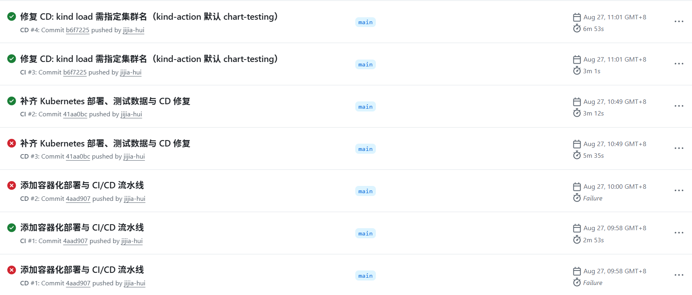

# 流水线记录报告 —— 2026-08-27

- **日期**:2026-08-27(实践第 3 天)
- **事件**:当日向 `main` 提交 **CI/CD 流水线**(commit `4aad907`「添加容器化部署与 CI/CD 流水线」),流水线自此上线;经 3 次提交迭代,**当日即实现 CI/CD 全链路全绿**。

---

## 当日交付的流水线(commit 4aad907,09:58)

一次提交同时落地 **CI 与 CD 两条流水线**及全部容器化基础设施(13 个文件,+477 行):

| 文件 | 作用 |
|---|---|
| `.github/workflows/ci.yml` | CI 流水线:后端测试 / 前端构建 / 镜像构建验证,3 个并行作业 |
| `.github/workflows/cd.yml` | CD 流水线:测试 → 镜像推送 GHCR → K8s 部署 → 健康检查 |
| `web_backend/Dockerfile`、`web_frontend/Dockerfile` | 前后端容器镜像定义(entrypoint、健康检查、Nginx 反代) |
| `docker-compose.yml` | 本地一键起栈(MySQL + 后端 + 前端,带健康检查依赖顺序) |

## 2. 当日运行记录总表(7 次运行,3 失败 → 4 成功)

| # | 运行 ID | 流水线 | 触发提交 | 时间(北京) | 时长 | 结论 |
|---|---|---|---|---|---|---|
| 1 | 33031814547 | CI #1 | 4aad907 | 09:58 | 2.9 min | ✅ success(首跑即过) |
| 2 | 33031812667 | CD #1 | 4aad907 | 09:58 | ≈0 | ❌ failure(启动即失败,0 作业) |
| 3 | 33031922740 | CD #2 | 4aad907 | 10:00 | ≈0 | ❌ failure(同上,同提交复推) |
| 4 | 33034469321 | CI #2 | 41aa0bc | 10:49 | 3.2 min | ✅ success |
| 5 | 33034469264 | CD #3 | 41aa0bc | 10:49 | 5.6 min | ❌ failure(kind 导入镜像步骤) |
| 6 | 33035102796 | CI #3 | b6f7225 | 11:01 | 3.0 min | ✅ success |
| 7 | 33035102825 | CD #4 | b6f7225 | 11:01 | **6.9 min** | ✅ **success(全链路首次全绿)** |

