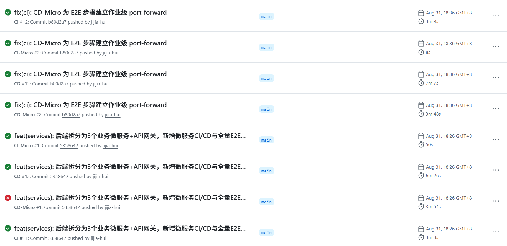

# 流水线记录报告 —— 2026-08-31(微服务 CI/CD 上线日)

- **日期**:2026-08-31(实践第 7 天)
- **事件**:当日提交 `5358642`「后端拆分为 3 个业务微服务 + API 网关,新增微服务 CI/CD 与全量 E2E 回归」(116 个文件,+6286 行),**CI-Micro / CD-Micro 两条微服务流水线首次上线**;首跑失败后 10 分钟内定位修复、当日复绿。

---

## 1. 当日交付内容(commit 5358642,18:24)

一次提交完成微服务化 + 流水线配套:

| 内容 | 说明 |
|---|---|
| 3 个业务微服务 + 网关 | `services/user_service`、`course_service`、`assignment_service`、`gateway` |
| `.github/workflows/ci-micro.yml` | 微服务 CI:按路径检测变更,**只测试/验证发生变更的服务** |
| `.github/workflows/cd-micro.yml` | 微服务 CD:变更检测 → 测试 → 构建推送镜像 → kind 部署 → E2E 回归 |
| 全量 E2E 回归套件 | `04_tests/e2e/run_e2e_micro.py`,UC01~UC14 + 跨服务级联清理,共 58 项断言,经 API 网关执行 |

微服务流水线设计要点(首日即具备,区别于单体流水线的增量能力):

1. **路径级变更检测**:以 `git diff` 判定 user / course / assignment / gateway / 编排(k8s、compose、部署脚本、cd-micro 工作流)哪些发生变更——只有变更过的服务才重新测试、重建镜像;编排类变更则全量重部署但不重建镜像;手动运行与打 `v*` 标签视为全部变更;
2. **测试零外部依赖**:各服务单元 + API 测试用 SQLite(`USE_SQLITE=1`),跨服务调用已 mock,无需数据库环境;
3. **版本化镜像**:仅变更服务构建并推送 GHCR,`SHA + latest` 双标签;
4. **部署即验证**:kind 集群逐服务 rollout + 健康检查 + 版本号核对,E2E 经网关回归,失败即止;部署日志 / E2E 报告 / 失败诊断(Pod 状态 + describe + 各服务日志)全部 artifact 归档。

## 2. 当日运行记录总表(8 次:7 成功 1 失败)

| # | 运行 ID | 流水线 | 触发提交 | 时间(北京) | 时长 | 结论 |
|---|---|---|---|---|---|---|
| 1 | 33382400792 | CI #11 | 5358642 | 18:26 | 3.1 min | ✅ 单体 CI 保持绿 |
| 2 | 33382400888 | CD #12 | 5358642 | 18:26 | 6.4 min | ✅ 单体 CD 保持绿 |
| 3 | 33382400913 | **CI-Micro #1** | 5358642 | 18:26 | 0.8 min | ✅ 微服务 CI 首跑即绿 |
| 4 | 33382400841 | **CD-Micro #1** | 5358642 | 18:26 | 3.9 min | ❌ E2E 步骤失败 |
| 5 | 33383201000 | CI #12 | b80d2a7 | 18:36 | 3.1 min | ✅ |
| 6 | 33383200991 | CD #13 | b80d2a7 | 18:36 | 7.1 min | ✅ |
| 7 | 33383200992 | CI-Micro #2 | b80d2a7 | 18:36 | 0.1 min | ✅ 快速跳过(见 §4.2) |
| 8 | 33383200990 | **CD-Micro #2** | b80d2a7 | 18:36 | 3.8 min | ✅ **全链路全绿,流水线内 E2E 58/58** |

> 同一次 push 同时触发 4 条流水线:微服务上线的同一提交下,**单体 CI/CD 依然全绿**——拆分没有破坏存量链路,新旧两套体系并行可用。

