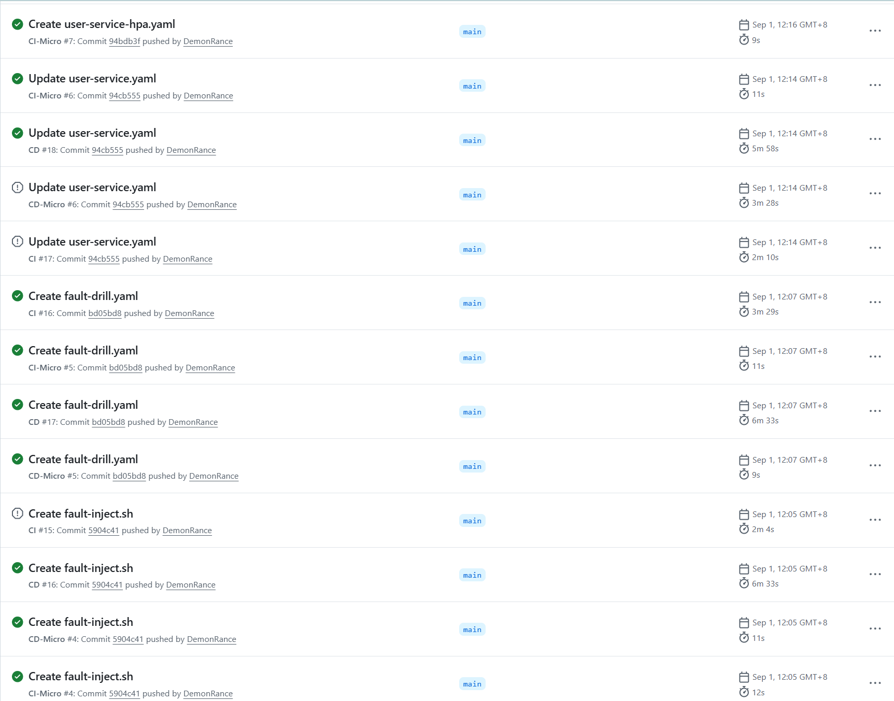
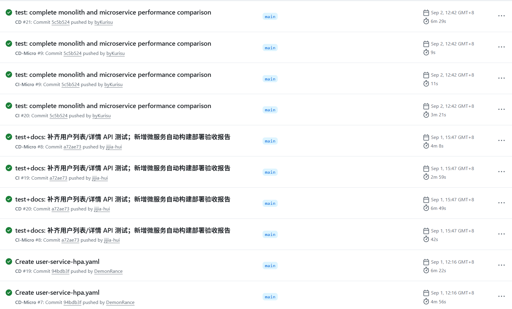

# 流水线记录报告 —— 2026-09-01(流水线验收日)

- **日期**:2026-09-01(实践第 8 天)
- **事件**:微服务自动构建部署**验收日**。当日 7 个提交(含组员 5 连发)被流水线全自动处理,共 **26 次运行**(main 分支 24 次 + `check8.27` 分支 2 次;22 成功 / 3 并发取消 / 1 分支上失败),当晚验收报告随代码入库、自证闭环。

---

## 1. 当日提交与流水线触发总表(26 次运行)

| 提交 | 时间 | 作者 | 内容 | 触发的运行 |
|---|---|---|---|---|
| `7463d8e` | 10:33 | jijia-hui | 拉取式编排内联 MySQL 三库初始化(+16) | CI #13 ✅ 3.1m · CD #14 ✅ 6.7m · CI-Micro #3 ✅ 0.1m · CD-Micro #3 ✅ 3.5m |
| `129eb52` | 10:35 | 崔子健 | 收口三服务部署:CI/CD 覆盖 check8.27(+117)——**推送到 `check8.27` 分支** | CI #14 ❌ 2.9m · CD #15 ✅ 6.8m(分支上,见 §3) |
| `5904c41` | 12:05 | DemonRance | Create fault-inject.sh(+86) | CI #15 ⊘ 取消 · CD #16 ✅ 6.5m · CI-Micro #4 ✅ 0.2m · CD-Micro #4 ✅ 0.2m |
| `bd05bd8` | 12:07 | DemonRance | Create fault-drill.yaml(+232,新工作流上线) | CI #16 ✅ 3.5m · CD #17 ✅ 6.5m · CI-Micro #5 ✅ 0.2m · CD-Micro #5 ✅ 0.1m |
| `94cb555` | 12:14 | DemonRance | Update k8s/micro/user-service.yaml(+21) | CI #17 ⊘ 取消 · CD #18 ✅ 6.0m · CI-Micro #6 ✅ 0.2m · CD-Micro #6 ⊘ 取消 |
| `94bdb3f` | 12:16 | DemonRance | Create k8s/micro/user-service-hpa.yaml(+36) | CI #18 ✅ 3.4m · CD #19 ✅ 6.4m · CI-Micro #7 ✅ 0.1m · CD-Micro #7 ✅ 4.9m |
| `a72ae73` | 15:47 | jijia-hui | 补齐用户列表/详情 API 测试;新增验收报告(+270) | CI #19 ✅ 3.0m · CD #20 ✅ 6.8m · CI-Micro #8 ✅ 0.7m · CD-Micro #8 ✅ 4.1m |

**main 分支当日 24 次运行 0 次失败**(22 成功 + 2 次并发取消,取消原因见 §4);3 位成员的提交全部被流水线自动处理——"代码提交后自动构建、测试、制作镜像和部署"的活证据。

