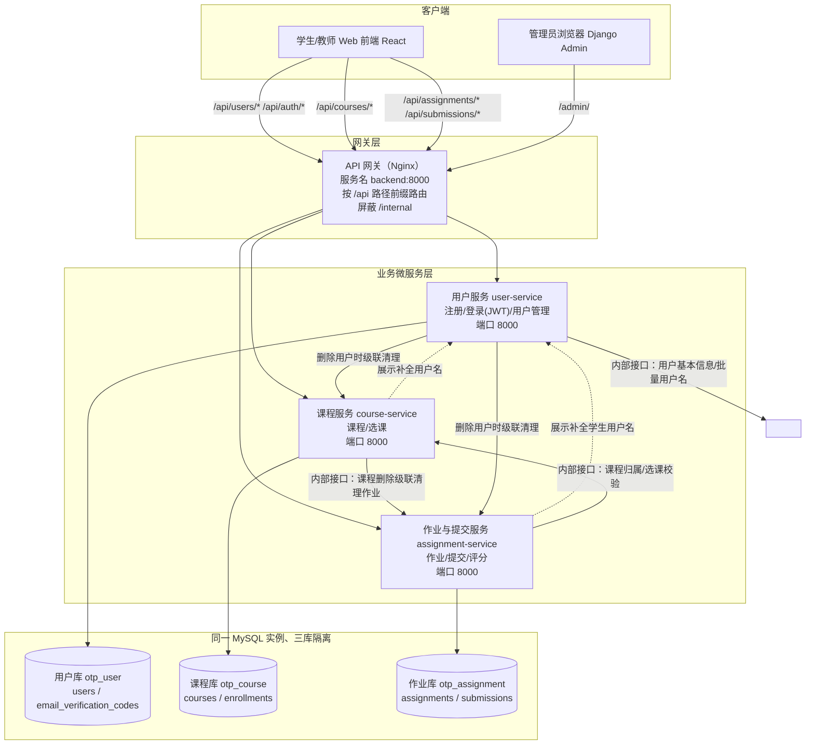

# 微服务划分图（v2，微服务版）

> 本文档为后端拆分的最终方案（v2 重写）。v1 草案画了 6 个服务（含 task/grade/notify）并标注 Spring Cloud Gateway、Redis、RabbitMQ，与仓库实际技术栈（Django/DRF）不符，服务粒度也存在机械拆分问题，已废弃。本方案以《软件工程基础实践》任务书为准：**至少 3 个业务微服务**（API 网关、前端、数据库不计入），不按用例数量机械拆分。

## 1. 划分结果总览

后端拆分为 **3 个业务微服务 + 1 个 API 网关**（网关不计入业务服务）：

| 服务 | 目录 | 职责（负责什么业务） | 数据库（同一 MySQL 实例） |
|---|---|---|---|
| **用户服务** user-service | `services/user_service/` | 账号注册（邮箱验证码）、登录签发 JWT、用户信息查询、用户删除（跨服务级联清理）、Django 管理后台 | `otp_user` |
| **课程服务** course-service | `services/course_service/` | 课程创建/编辑/删除、学生选课/退课、选课关系与课程归属查询 | `otp_course` |
| **作业与提交服务** assignment-service | `services/assignment_service/` | 作业发布/编辑/删除（含参考文档）、学生提交、教师评分、提交记录查询 | `otp_assignment` |
| API 网关 gateway（不计业务服务） | `services/gateway/` | Nginx 按 URL 前缀把 `/api/*` 路由到三个业务服务；屏蔽内部接口 `/internal/*` | — |

跨服务调用关系（详细失败处理见《跨服务调用说明.md》）：

| 调用方 → 被调方 | 场景 | 失败策略 |
|---|---|---|
| course-service → user-service | 课程展示时补全教师/学生用户名 | 降级：用户名返回 `null`，接口不失败 |
| assignment-service → user-service | 提交列表补全学生用户名 | 降级：`student_name` 返回 `null` |
| assignment-service → course-service | 创建/编辑作业校验课程归属；提交校验选课；评分校验授课教师；教师提交列表圈定课程范围 | 快速失败：503，写操作不做绕过 |
| course-service → assignment-service | 删除课程时级联删除其作业与提交 | 快速失败：502，课程不删除 |
| user-service → course-service / assignment-service | 删除用户时级联清理课程/选课/作业/提交 | 快速失败：502，用户不删除 |

## 2. 为什么是这 3 个服务（划分理由）

1. **按业务能力（domain）划分，而不是按用例或页面划分。** 三个服务分别对应"人"、"课"、"课业产物"三个业务概念，边界稳定：用户账号生命周期、课程与选课关系、作业与提交评分。
2. **数据 ownership 单一。** 每张业务表只归一个服务（详见《数据表归属方案.md》），服务间只存对方的主键 ID，不跨库联表。
3. **不把"评分"拆成独立服务。** 评分不是独立聚合：`submissions.status/score` 与提交记录同表同事务，拆开会让每次评分都变成跨服务事务。评分属于作业与提交服务的业务动作。
4. **不把"认证"拆成独立服务。** 采用无状态 JWT（HS256 共享密钥）：用户服务登录时签发，三个服务各自本地验签，**鉴权不产生任何跨服务调用**。因此也不需要 v1 草案中的 `tokens` 表（Token 不落库）。
5. **不设通知服务/Redis/RabbitMQ。** 当前系统没有缓存与异步消息的业务需求（v1 草案中的 notify-service 在原系统里并不存在），按需引入，避免为架构而架构。后续若做异步评测再引入 MQ。
6. **作业与提交放同一个服务。** 前端作业页一次拉取"作业 + 该作业提交列表"，二者是最强的读写关联（`submissions.assignment_id` 本服务内真实外键）；拆开会让最高频的页面变成两次跨服务聚合。
7. **网关用 Nginx 而不是自研/Spring Cloud Gateway。** 路由是纯路径前缀映射，无动态路由需求；Nginx 与现有技术栈一致、零代码维护。网关在编排中的服务名为 `backend`、端口 8000，**前端镜像无需任何改动**（原前端 Nginx 就是反代 `backend:8000`）。

## 3. 单独构建 / 测试 / 部署

| 维度 | 说明 |
|---|---|
| 代码独立 | 每个服务一个独立 Django 工程（`services/<name>/`），独立 `manage.py`、`requirements.txt`、`Dockerfile`、测试目录；公共的 JWT 验签/内部调用客户端模块在三个服务中各持一份拷贝（约百行，保证服务零耦合、可独立演进） |
| 构建独立 | CI 按路径检测变更，只重新构建发生变更的服务镜像（`ghcr.io/<owner>/otp-<service>`），版本号 = 提交 SHA / `v*` 标签，另推 `latest` |
| 测试独立 | 每个服务自带单元 + API 测试（`python services/<name>/manage.py test`，SQLite，无需数据库环境）；E2E 回归经网关覆盖 UC01~UC14 全部用例 |
| 部署独立 | 三个服务分别是独立的 K8s Deployment/Service 与 compose 服务；改一个服务只滚动更新它自己的 Deployment |
| 可观测 | 每个服务暴露 `/api/live/`（存活）、`/api/ready/`（就绪，含 DB 检查）、`/api/health/`（合并探活 + **版本号**），网关暴露 `/api/health/{user,course,assignment}/` 逐服务探活 |

## 4. 对外行为保持不变

对外 REST API（见《对外服务接口.md》）**逐条保持与单体版一致**（路径、请求/响应、状态码），前端与既有 E2E 脚本无需修改即可工作；差异只有两点：

1. `POST /api/auth/token/` 返回的 Token 从 DRF 数据库 Token 换成无状态 JWT（仍是 `{ "token": "..." }`，仍用 `Authorization: Token <jwt>` 头，有效期 24h）。
2. 删除用户/课程的级联删除从数据库外键级联改为跨服务编排（行为一致，失败处理见《跨服务调用说明.md》）。
