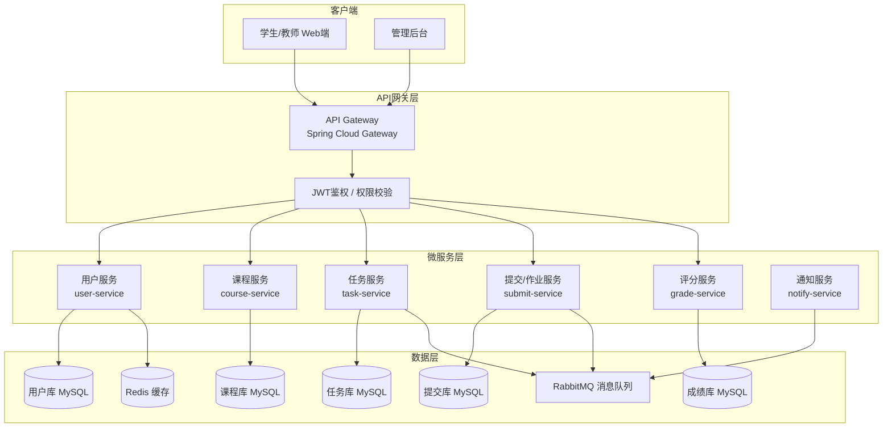

```mermaid
flowchart TD
    subgraph 客户端
        Web[学生/教师 Web端]
        Admin[管理后台]
    end

    subgraph API网关层
        Gateway[API Gateway\nSpring Cloud Gateway]
        Auth[JWT鉴权 / 权限校验]
    end

    subgraph 微服务层
        UserService[用户服务\nuser-service]
        CourseService[课程服务\ncourse-service]
        TaskService[任务服务\ntask-service]
        SubmitService[提交/作业服务\nsubmit-service]
        GradeService[评分服务\ngrade-service]
        NotifyService[通知服务\nnotify-service]
    end

    subgraph 数据层
        MySQL1[(用户库 MySQL)]
        MySQL2[(课程库 MySQL)]
        MySQL3[(任务库 MySQL)]
        MySQL4[(提交库 MySQL)]
        MySQL5[(成绩库 MySQL)]
        Redis[(Redis 缓存)]
        MQ[RabbitMQ 消息队列]
    end

    Web --> Gateway
    Admin --> Gateway
    Gateway --> Auth

    Auth --> UserService
    Auth --> CourseService
    Auth --> TaskService
    Auth --> SubmitService
    Auth --> GradeService

    UserService --> MySQL1
    UserService --> Redis
    CourseService --> MySQL2
    TaskService --> MySQL3
    TaskService --> MQ
    SubmitService --> MySQL4
    SubmitService --> MQ
    GradeService --> MySQL5
    NotifyService --> MQ

```
