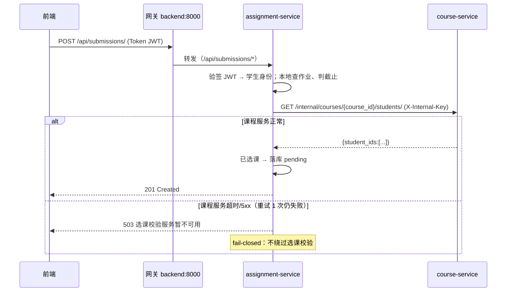

# 跨服务调用说明

> 说明微服务之间**为什么调用、怎么调用、失败怎么办**。任务书要求：跨服务数据操作通过接口/事件/消息完成，并说明调用失败时的处理办法。

## 1. 调用机制

| 机制 | 方案 |
|---|---|
| 协议 | 同步 HTTP/JSON（Django + DRF 内部接口） |
| 服务发现 | 编排层服务名（Compose/K8s DNS）：`user-service:8000`、`course-service:8000`、`assignment-service:8000`，地址可用环境变量 `USER_SERVICE_URL` 等覆盖 |
| 认证 | 内部接口请求头 `X-Internal-Key: <INTERNAL_API_KEY>`（共享密钥，K8s Secret / compose 环境变量注入）；网关对 `/internal/*` 一律 403，内部接口不可能从外部到达 |
| 超时 | 连接 2s、读取 3s |
| 重试 | 网络/超时类失败重试 1 次（仅幂等的 GET 与按 ID 清理的 purge；写校验类调用重试不改变结果） |
| 不引入 MQ | 当前没有异步业务；同步调用 + 明确失败语义即可满足任务书"接口、事件或消息"中的"接口"方式 |

**总原则：读展示、快失败。** 展示类数据（用户名补全）失败时**降级**返回缺省值；授权/业务校验类调用失败时**快速失败**返回明确错误，绝不绕过校验（fail-closed）。

## 2. 调用场景与失败处理矩阵

| # | 场景（触发接口） | 调用链 | 失败时的行为（对外可见） |
|---|---|---|---|
| 1 | 课程列表/详情需要教师、学生用户名（`GET /api/courses/*`） | course → user `GET /internal/users/?ids=` | **降级**：`teacher_name` / `students[].username` 返回 `null`，课程数据正常返回，接口不失败 |
| 2 | 提交列表需要学生用户名（`GET /api/submissions/*`） | assignment → user `GET /internal/users/?ids=` | **降级**：`student_name` 返回 `null`，提交数据正常返回 |
| 3 | 创建/编辑/删除作业校验课程存在与授课教师（`POST/PATCH/DELETE /api/assignments/*`） | assignment → course `GET /internal/courses/{id}/` | **快速失败 503**：`{"detail":"课程服务暂不可用，请稍后重试"}`；作业不创建（fail-closed，防止越过归属校验写入脏数据） |
| 4 | 学生提交作业前校验已选课（`POST /api/submissions/`） | assignment → course `GET /internal/courses/{id}/students/` | **快速失败 503**：`{"detail":"选课校验服务暂不可用，请稍后重试"}`；提交不落库 |
| 5 | 教师评分前校验是课程授课教师（`POST /api/submissions/{id}/grade/`） | assignment → course `GET /internal/courses/{id}/` | **快速失败 503**，评分不生效 |
| 6 | 教师查看提交列表（`GET /api/submissions/`） | assignment → course `GET /internal/courses/?teacher_id=` | **快速失败 503**（无法圈定授权范围时宁可报错也不返回别人的数据）；学生查询不受影响（本地数据） |
| 7 | 删除课程级联删除作业与提交（`DELETE /api/courses/{id}/`） | course → assignment `POST /internal/courses/purge/` | **快速失败 502**：`{"detail":"关联作业数据清理失败，课程未删除"}`；课程保留，可重试 |
| 8 | 删除用户级联清理（`DELETE /api/users/{id}/`） | user → course `POST /internal/users/{id}/purge/`（其内部先触发 #7 清理课程）→ user → assignment `POST /internal/users/{id}/purge/` → 删用户 | 任一步失败 **502**：`{"detail":"关联数据清理失败，用户未删除"}`；用户保留，可重试（清理操作幂等） |
| 9 | 登录 / 鉴权 | 无跨服务调用（JWT 本地验签） | 用户服务宕机只影响登录与注册，已登录用户对课程/作业服务照常可用 |

> 超时与重试已计入失败判定：重试 1 次后仍失败即按上表处理。所有降级/失败均写 WARN 日志（服务名 + 调用目标 + 耗时），现场可用 `docker compose logs` / `kubectl logs` 定位（部署失败排查记录另见《部署文档.md》）。

## 3. 时序示例（学生提交作业，场景 #4）



## 4. 级联删除编排（替代原数据库外键级联）

删除用户（`DELETE /api/users/{id}/`）按固定顺序编排，任一步失败即中止且已完成的清理幂等可重试：

```
user-service                      course-service                 assignment-service
DELETE /api/users/{id}/
  │ 1. POST /internal/users/{id}/purge/
  ├──────────────────────────────►  删该用户选课记录(enrollments)
  │                                 找到他授课的课程 course_ids
  │                                 2. POST /internal/courses/purge/ ──►  删这些课程的作业+提交
  │                                 删这些课程(courses)
  │◄──────────────────────────────  {course_ids, ...}
  │ 3. POST /internal/users/{id}/purge/ ─────────────────────────────►  删该学生的其余提交
  │ 4. 删除 users 表中的该用户（最后才删自己）
  └─► 204
```

删除课程（`DELETE /api/courses/{id}/`）同理：先 #7 清理作业与提交，成功后才删课程记录。

## 5. 一致性边界（如实说明）

- 未引入分布式事务/Saga：删除级联采用**编排 + 幂等清理 + 失败中止可重试**，最坏情况是"下游已清理、用户删除失败重试"（数据无损）或"清理到一半失败"（残留数据，重试即清干净）。对教学平台这类低并发删除场景可接受。
- 跨服务只读展示（用户名）采用**即时拉取 + 降级**，不做数据冗余复制，因此不存在双写不一致问题。
